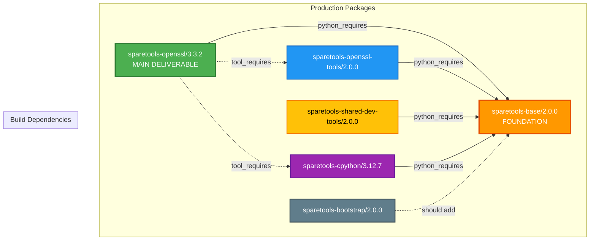
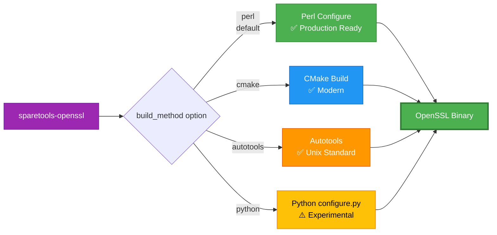
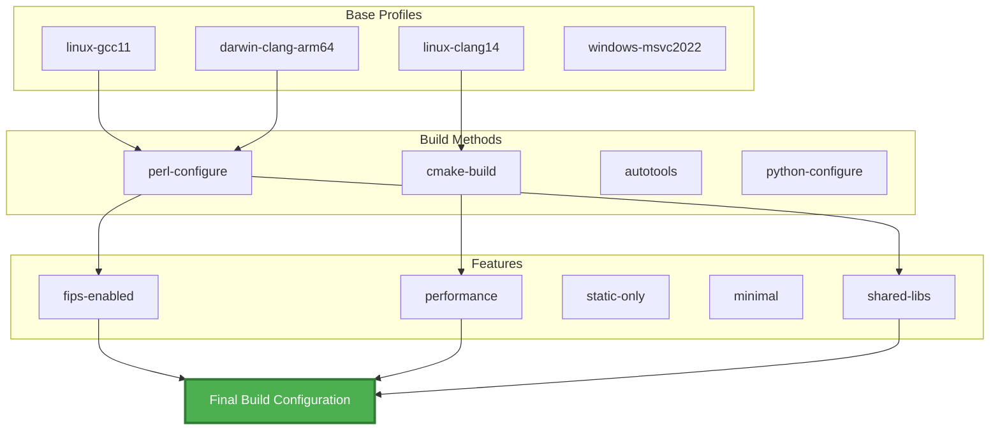
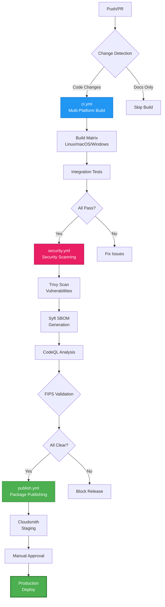
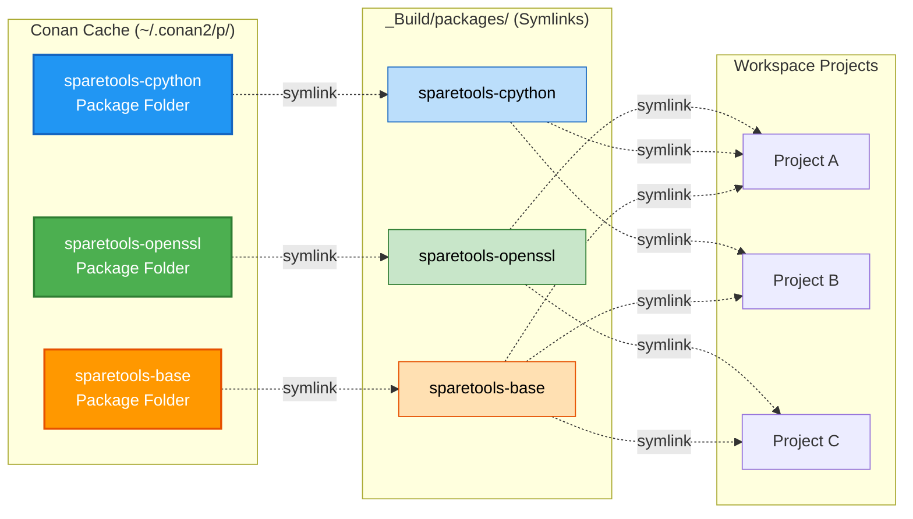
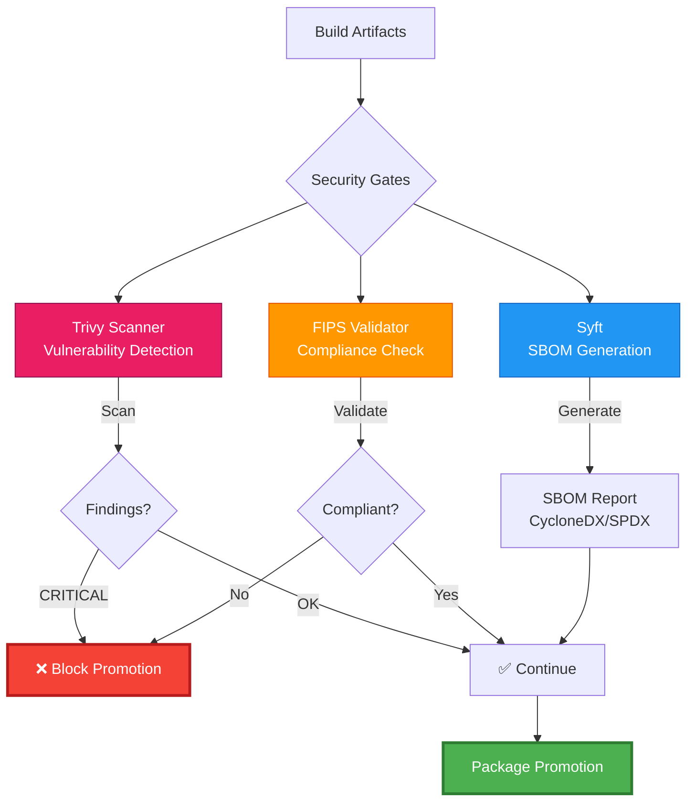
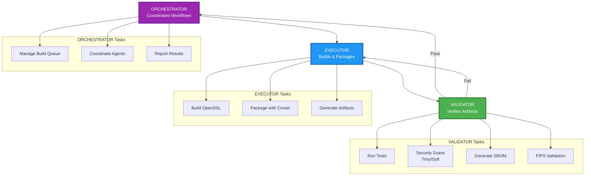

# SpareTools Architecture

## Overview

SpareTools is a modern, Python-based tooling ecosystem for OpenSSL development, building, and deployment. It provides a unified package system with multiple build methods, comprehensive security integration, and zero-copy deployment patterns.

## Core Architecture

### Package Ecosystem



**Legend:**
- Solid arrows (→): `python_requires` (recipe dependencies)
- Dashed arrows (-.->): `tool_requires` (build-time tools)

### Multi-Build System



### Profile Composition System



**Profile Location:** `packages/sparetools-openssl-tools/profiles/`
- **base/** — Platform + compiler (6 profiles)
- **build-methods/** — Build system selection (4 profiles)
- **features/** — Feature toggles (5 profiles)

## CI/CD Workflow Chain



## Zero-Copy Deployment Pattern



**Benefits:**
- ✅ **99% disk space savings** (symlinks ~50KB vs binaries ~500MB)
- ✅ **Instant environment setup** (no binary copying)
- ✅ **Atomic updates** (change symlink target = instant upgrade)
- ✅ **Single source of truth** (all binaries in Conan cache)

## Security Integration



## Directory Structure

```
sparetools/
├── packages/                    # Conan packages (source)
│   ├── sparetools-base/         # Foundation utilities
│   ├── sparetools-cpython/      # Prebuilt Python runtime
│   ├── sparetools-openssl/      # Main OpenSSL package
│   ├── sparetools-openssl-tools/# Build tooling & profiles
│   ├── sparetools-shared-dev-tools/
│   ├── sparetools-bootstrap/    # Orchestration system
│   └── deprecated/              # Archived packages
├── _Build/                      # Zero-copy build artifacts
│   ├── openssl-builds/          # OpenSSL build results
│   │   ├── master/              # Development branch
│   │   └── 3.3.2/               # Release builds
│   ├── packages/                # Symlinks to Conan cache
│   └── conan-cache -> ~/.conan2 # Symlink to cache root
├── build_results/               # Build reports
├── reviews/                     # Release reviews
├── test_results/                # Test outputs
├── test/                        # Test suite
├── scripts/                     # Automation scripts
├── docs/                        # Documentation
├── workspaces/                  # IDE configurations
└── .github/workflows/           # CI/CD pipelines
```

## Component Relationships

### Bootstrap Orchestration



## Key Design Principles

1. **Single Source of Truth**: All artifacts stored once in Conan cache
2. **Zero-Copy Deployment**: Symlinks eliminate binary duplication
3. **Multi-Method Flexibility**: Support multiple build systems
4. **Security First**: Integrated scanning and validation
5. **CI/CD Integration**: Automated workflows with manual approvals
6. **Modular Architecture**: Independent packages with clear dependencies

## Data Flow

### Build Process

1. **Source** → `packages/sparetools-openssl/`
2. **Dependencies** → Resolve via Conan (base, tools, cpython)
3. **Configuration** → Apply profiles (platform + features)
4. **Build** → Execute selected method (perl/cmake/autotools/python)
5. **Package** → Create Conan package in cache
6. **Test** → Run integration tests
7. **Scan** → Security validation (Trivy, Syft, FIPS)
8. **Publish** → Upload to Cloudsmith + GitHub Packages

### Consumption Pattern

1. **Remote Add** → `conan remote add sparesparrow-conan ...`
2. **Install** → `conan install --requires=sparetools-openssl/3.3.2`
3. **Symlink** → Zero-copy deployment to workspace
4. **Use** → Link libraries in consumer projects

## External Integrations

- **Conan Center**: Base dependencies (CMake, Ninja, etc.)
- **Cloudsmith**: Package hosting and distribution
- **GitHub Packages**: Secondary package registry
- **Security Tools**: Trivy, Syft, CodeQL integration
- **CI/CD**: GitHub Actions for multi-platform builds

---

*Last Updated: 2025-11-03*