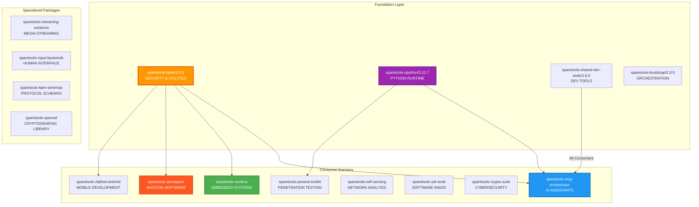
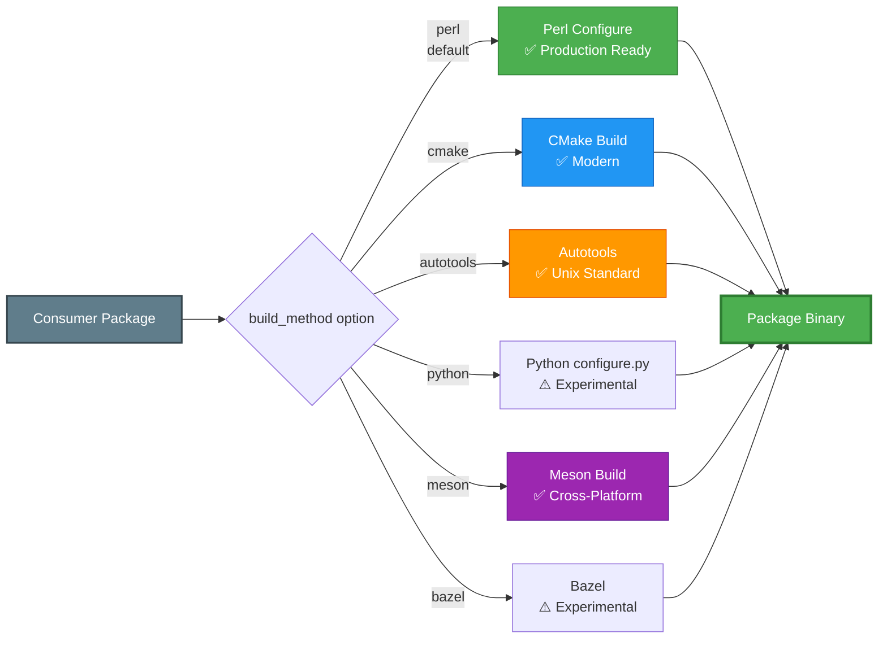
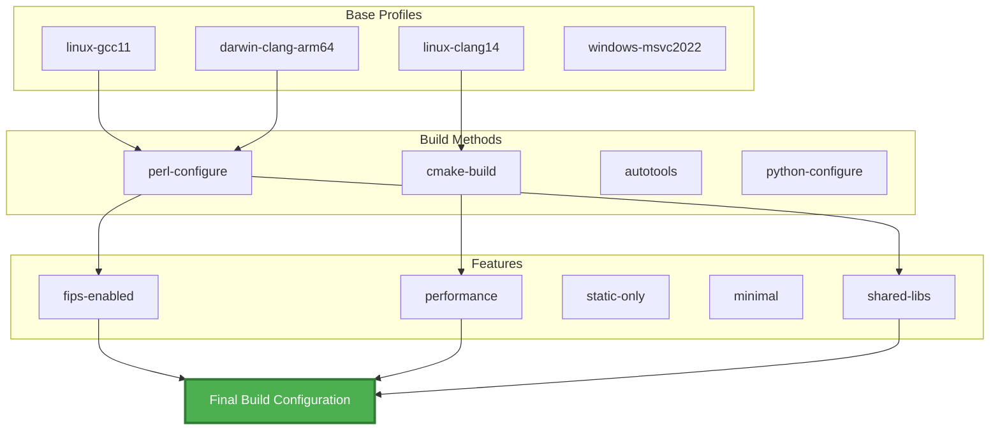
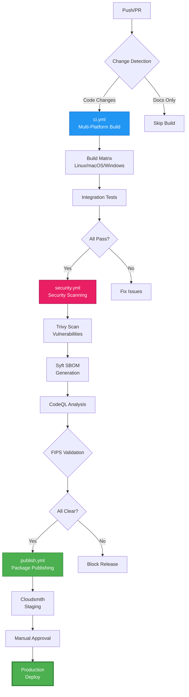
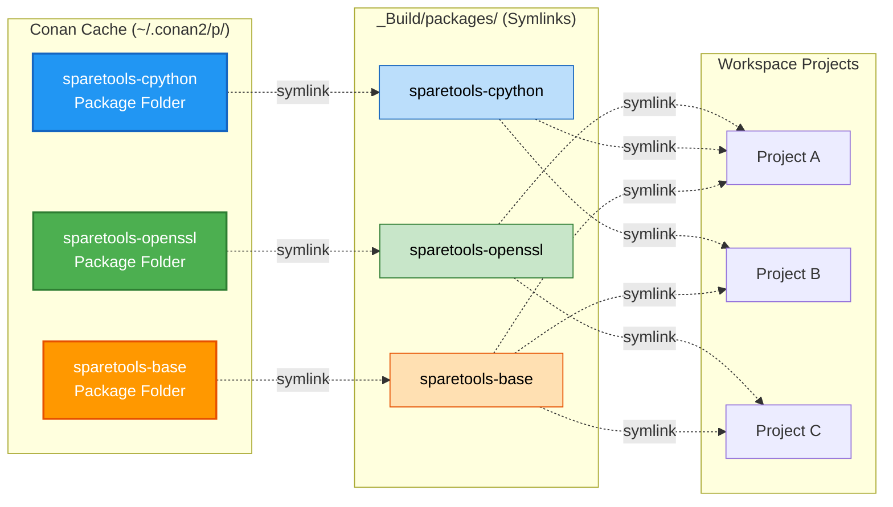
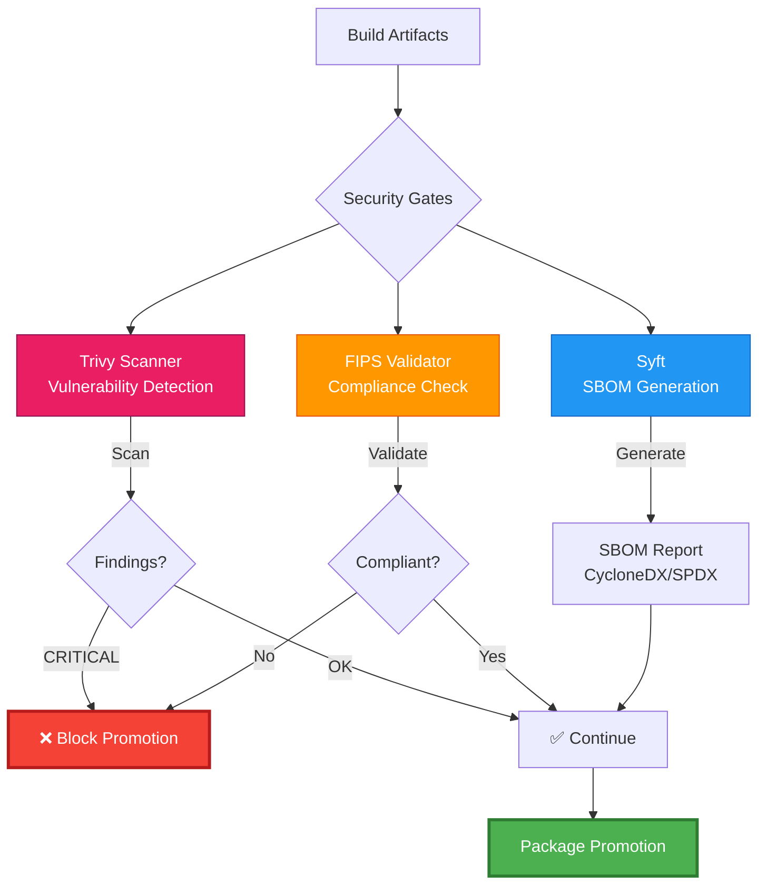
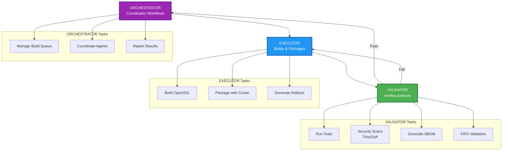

# SpareTools Multi-Domain Architecture

## Overview

SpareTools is a comprehensive, multi-domain package ecosystem spanning embedded systems, AI/ML, cybersecurity, aerospace, and enterprise applications. It provides hermetic builds, security-first architecture, and zero-copy deployment patterns across diverse technology domains.

## Core Architecture

### Multi-Domain Package Ecosystem



**Legend:**
- Solid arrows (→): `python_requires` (recipe dependencies)
- Dashed arrows (-.->): `tool_requires` (build-time tools)

### Multi-Build System



### Profile Composition System



**Profile Location:** `packages/sparetools-openssl-tools/profiles/`
- **base/** — Platform + compiler (6 profiles)
- **build-methods/** — Build system selection (4 profiles)
- **features/** — Feature toggles (5 profiles)

## CI/CD Workflow Chain



## Zero-Copy Deployment Pattern



**Benefits:**
- ✅ **99% disk space savings** (symlinks ~50KB vs binaries ~500MB)
- ✅ **Instant environment setup** (no binary copying)
- ✅ **Atomic updates** (change symlink target = instant upgrade)
- ✅ **Single source of truth** (all binaries in Conan cache)

## Security Integration



## Directory Structure

```
sparetools/
├── packages/                    # Conan packages by domain
│   ├── foundation/              # Core infrastructure
│   │   ├── sparetools-base/      # Security gates & utilities
│   │   ├── sparetools-cpython/   # Prebuilt Python runtime
│   │   ├── sparetools-bootstrap/ # Orchestration framework
│   │   └── sparetools-shared-dev-tools/ # Development utilities
│   ├── consumers/               # Domain-specific applications
│   │   ├── mcp/                  # AI assistant protocols
│   │   ├── esp32/                # Embedded systems
│   │   ├── aerospace/            # Aviation software
│   │   ├── android/              # Mobile development
│   │   ├── openssl/              # Cryptographic libraries
│   │   └── [other-domains]/      # Additional consumer domains
│   ├── [other-categories]/       # SDR, security, streaming, etc.
│   └── deprecated/               # Archived packages
├── _Build/                      # Zero-copy build artifacts
│   ├── packages/                # Symlinks to Conan cache
│   └── conan-cache -> ~/.conan2 # Symlink to cache root
├── build_results/               # Build reports & artifacts
├── test_results/                # Test outputs & coverage
├── test/                        # Multi-domain test suite
├── scripts/                     # Automation & utilities
├── docs/                        # Comprehensive documentation
├── templates/                   # Project templates by domain
├── workspaces/                  # IDE configurations
├── mcp/                         # MCP server ecosystem
└── .github/workflows/           # CI/CD pipelines
```

## Component Relationships

### Bootstrap Orchestration



## Key Design Principles

1. **Multi-Domain Architecture**: Consumer-centric organization spanning diverse technology domains
2. **Hermetic Builds**: No system dependencies beyond SpareTools packages
3. **Zero-Copy Deployment**: Symlinks eliminate binary duplication across domains
4. **Security-First Approach**: Integrated scanning, FIPS compliance, and supply chain security
5. **Layered Design**: Foundation → Runtime → Utilities → Orchestration → Consumer layers
6. **Template-Based Development**: Rapid project creation across technology domains
7. **CI/CD Integration**: Automated workflows with manual approvals for production releases

## Data Flow

### Multi-Domain Build Process

1. **Source** → Domain-specific package (e.g., `packages/consumers/mcp/sparetools-mcp-orchestrator/`)
2. **Dependencies** → Resolve via Conan (foundation + domain-specific requirements)
3. **Configuration** → Apply profiles (platform + features + domain requirements)
4. **Build** → Execute selected method (varies by domain: cmake, meson, autotools, etc.)
5. **Package** → Create Conan package in cache with domain metadata
6. **Test** → Run domain-specific integration and unit tests
7. **Scan** → Security validation (Trivy, Syft, domain-specific checks)
8. **Publish** → Upload to Cloudsmith with domain categorization

### Cross-Domain Consumption Pattern

1. **Remote Add** → `conan remote add sparesparrow-conan ...`
2. **Install Foundation** → `conan install --tool-requires=sparetools-cpython/3.12.7`
3. **Install Domain** → `conan install --requires=sparetools-mcp-orchestrator/2.0.3`
4. **Symlink** → Zero-copy deployment across multiple domains
5. **Orchestrate** → Use bootstrap tools for multi-domain project setup

## External Integrations

### Package Management
- **Conan Center**: Base dependencies (CMake, Ninja, Meson, etc.)
- **Cloudsmith**: Primary package registry with domain categorization
- **GitHub Packages**: Secondary registry and container hosting

### Development Tools
- **VS Code**: Workspace configurations for multi-domain development
- **Cursor**: AI-assisted development with domain-specific prompts
- **GitHub Copilot**: Code completion across technology domains

### Security & Compliance
- **Trivy**: Vulnerability scanning across all domains
- **Syft**: SBOM generation with domain-specific metadata
- **CodeQL**: Static analysis for multiple languages
- **FIPS Validators**: Cryptographic compliance across domains

### CI/CD & Testing
- **GitHub Actions**: Multi-platform, multi-domain build matrices
- **Dependabot**: Automated dependency updates across domains
- **Codecov**: Test coverage tracking for all packages

### Domain-Specific Integrations
- **ESP32**: PlatformIO, ESP-IDF toolchain integration
- **Android**: JNI, NDK, cross-ABI compilation
- **Aerospace**: DO-178C compliance tooling
- **MCP**: Model Context Protocol server ecosystem
- **SDR**: RTL-SDR, HackRF, and other radio hardware

---

*Last Updated: December 29, 2025*