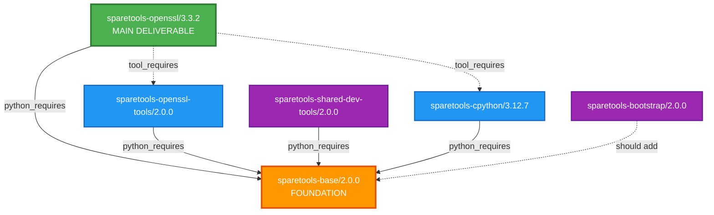
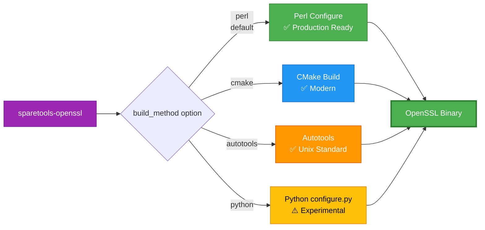
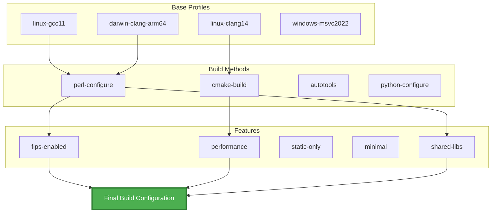
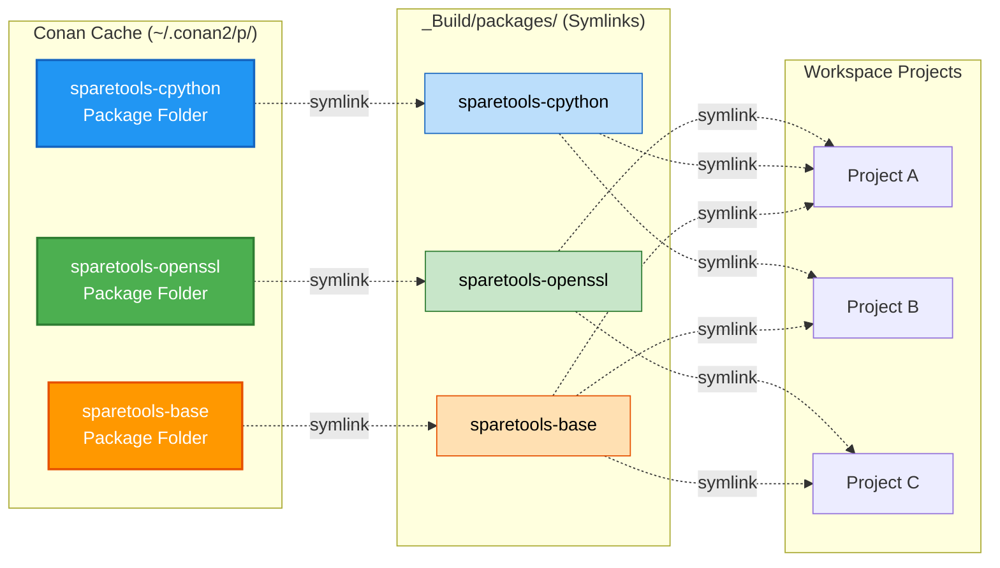
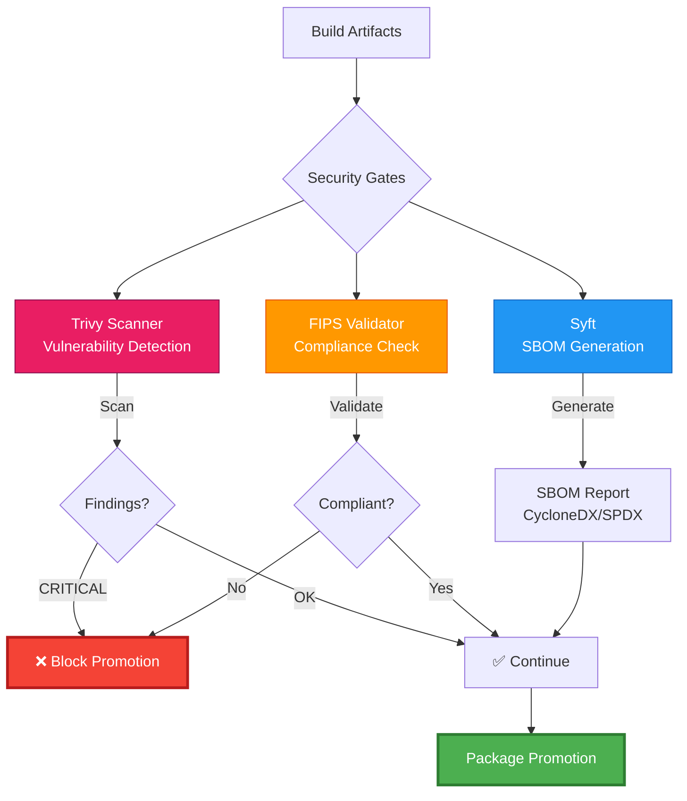
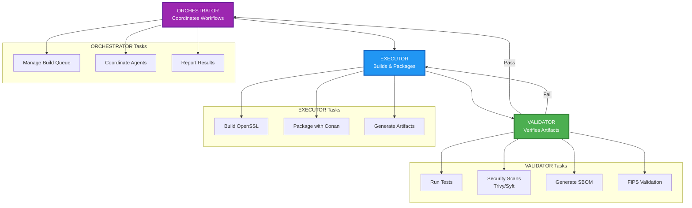
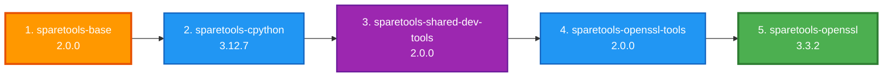
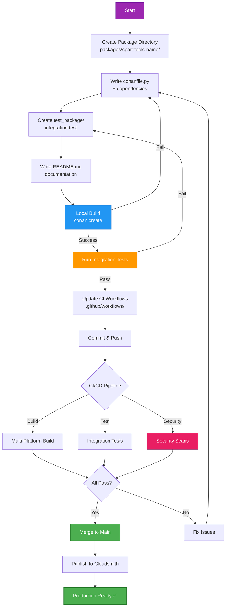
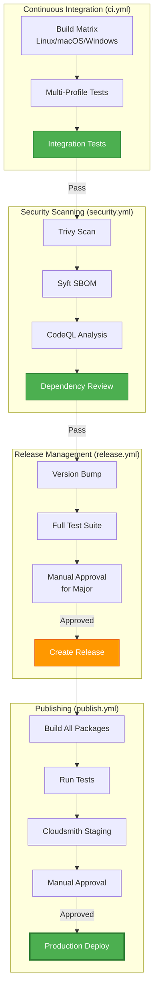

# CLAUDE.md

This file provides guidance to Claude Code (claude.ai/code) when working with code in this repository.

---

## Project Overview

SpareTools is a Conan 2.x-based DevOps ecosystem for building OpenSSL with multiple build methods (Perl Configure, CMake, Autotools, Python), integrated security scanning (Trivy, Syft, FIPS), and a zero-copy deployment pattern based on OS-level symlinks to a single Conan cache location. 

Repository: https://github.com/sparesparrow/sparetools  
Cloudsmith: https://cloudsmith.io/~sparesparrow-conan/repos/openssl-conan/

---

## Essential Commands

### Package Development

```
# Build a package locally (OpenSSL example)
cd packages/sparetools-openssl
conan create . --version=3.3.2 --build=missing

# Build with specific profile and build method
conan create . --version=3.3.2 \
  -pr:b ../sparetools-openssl-tools/profiles/base/linux-gcc11 \
  -pr:b ../sparetools-openssl-tools/profiles/build-methods/perl-configure \
  -pr:b ../sparetools-openssl-tools/profiles/features/fips-enabled

# Test a built package
conan test test_package sparetools-openssl/3.3.2@

# Install from Cloudsmith (consumer workflow)
conan remote add sparesparrow-conan \
  https://conan.cloudsmith.io/sparesparrow-conan/openssl-conan/
conan install --requires=sparetools-openssl/3.3.2 -r sparesparrow-conan
```

### Building All Packages

```
# Build base packages first (order matters due to dependencies)
cd packages/sparetools-base
conan create . --version=2.0.0

cd ../sparetools-cpython
conan create . --version=3.12.7

cd ../sparetools-shared-dev-tools
conan create . --version=2.0.0

cd ../sparetools-openssl-tools
conan create . --version=2.0.0

cd ../sparetools-openssl
conan create . --version=3.3.2 --build=missing
```

### Security Scanning

```
# Run Trivy vulnerability scan
trivy fs --security-checks vuln .

# Generate SBOM with Syft
syft packages . -o cyclonedx-json > sbom.json
syft packages . -o spdx-json > sbom-spdx.json

# FIPS validation (if module present)
python3 -c "from sparetools.openssl_tools.fips_validator import FIPSValidator; \
  FIPSValidator().validate_module('/path/to/fips/module')"
```

### Testing

```
# Integration test for OpenSSL package
cd packages/sparetools-openssl
conan test test_package sparetools-openssl/3.3.2@

# Validate installation script
bash scripts/validate-install.sh
```

### CI/CD Workflows

```
# Manually trigger publish workflow
gh workflow run publish.yml

# View workflow runs
gh run list --workflow=ci.yml

# Check security scan results
gh run list --workflow=security.yml
```

---

## Architecture

### Package Ecosystem (Production)

Current Versions (v2.0.0 ecosystem):
- sparetools-base/2.0.0 — Foundation utilities (security gates, symlink helpers)
- sparetools-cpython/3.12.7 — Prebuilt Python runtime
- sparetools-shared-dev-tools/2.0.0 — Generic development utilities
- sparetools-openssl-tools/2.0.0 — OpenSSL-specific tooling (profiles, FIPS validator)
- sparetools-bootstrap/2.0.0 — 3-agent orchestration system
- sparetools-mcp-orchestrator/2.0.0 — MCP/AI integration
- sparetools-openssl/3.3.2 — Main deliverable (OpenSSL library with 4 build methods)

Deprecated Packages (to be removed):
- sparetools-openssl-cmake (consolidated)
- sparetools-openssl-autotools (consolidated)
- sparetools-openssl-hybrid (experimental Python configure.py)
- sparetools-openssl-tools-mini (merged into sparetools-openssl-tools)

### Dependency Graph



**Legend:**
- Solid arrows (→): `python_requires` (recipe dependencies)
- Dashed arrows (-.->): `tool_requires` (build-time tools)

### Multi-Build System



**Profile Composition System:**



**Profiles Location:** `packages/sparetools-openssl-tools/profiles/`
- **base/** — Platform + compiler (6 profiles)
- **build-methods/** — Build system selection (4 profiles)
- **features/** — Feature toggles (5 profiles)

---

## Directory Structure

```
sparetools/
├── packages/                    # Conan packages
│   ├── sparetools-base/         # Foundation utilities
│   ├── sparetools-cpython/      # Bundled Python runtime
│   ├── sparetools-openssl/      # Main OpenSSL package
│   ├── sparetools-openssl-tools/# OpenSSL-specific tooling
│   ├── sparetools-shared-dev-tools/  # Development utilities
│   └── sparetools-bootstrap/    # Orchestration system
├── _Build/                      # Build artifacts (zero-copy)
│   ├── openssl-builds/          # OpenSSL build artifacts
│   │   ├── master/              # OpenSSL master branch
│   │   ├── 3.6.0/               # OpenSSL 3.6.0 release
│   │   ├── orchestration/       # Build scripts
│   │   └── logs/                # Build logs
│   ├── packages/                # Symlinks to Conan cache packages
│   └── conan-cache -> ~/.conan2 # Symlink to Conan cache
├── build_results/               # Build reports
│   └── build-report.md          # Latest build report
├── reviews/                     # Release reviews
│   └── REVIEW-SUMMARY.md        # v2.0.0 review summary
├── test_results/                # Test results
│   ├── CROSS-PLATFORM-TEST-REPORT.md
│   ├── validation-report.md
│   └── openssl-builds -> ../_Build/openssl-builds  # Symlink
├── test/                        # Test suite
│   └── integration/             # Integration tests
├── scripts/                     # Automation scripts
│   └── build-and-upload.sh      # Build & upload to Cloudsmith
├── docs/                        # Documentation
├── workspaces/                  # VS Code workspaces
└── .github/workflows/           # CI/CD workflows
```

**Key Directories:**

- **_Build/**: Zero-copy build artifacts using symlinks to Conan cache
- **build_results/**: Build reports and validation output
- **reviews/**: Release reviews and comprehensive summaries
- **test_results/**: Test reports (openssl-builds is a symlink to _Build/)

---

## Zero-Copy Symlink Strategy

This repository uses a zero-copy deployment pattern: artifacts are stored once in the Conan cache and exposed to all projects via OS-level symlinks instead of copying files.



**Benefits:**
- ✅ **99% disk space savings** (symlinks ~50KB vs binaries ~500MB)
- ✅ **Instant environment setup** (no binary copying)
- ✅ **Atomic updates** (change symlink target = instant upgrade)
- ✅ **Single source of truth** (all binaries in Conan cache)

### Principles

- **Single Source of Truth**: All built artifacts live in `~/.conan2/p/.../p/` (Conan cache package_folder)
- **No Copies**: Projects never duplicate binaries; they create symlinks into the cache
- **Atomic Updates**: Upgrades swap symlink targets, making environment switches instantaneous
- **Portable Layout**: Workspaces expose bin/lib/include via consistent symlinked folders

### Workspace Layout (SpareTools Repository)

```
/home/sparrow/sparetools/
├── _Build/                   # Zero-copy build artifacts
│   ├── conan-cache -> ~/.conan2   # Symlink to Conan cache root
│   ├── packages/             # Symlinks to built packages
│   │   ├── sparetools-base -> ~/.conan2/p/.../sparetools-base/p
│   │   ├── sparetools-cpython -> ~/.conan2/p/.../sparetools-cpython/p
│   │   ├── sparetools-openssl-tools -> ~/.conan2/p/.../openssl-tools/p
│   │   └── sparetools-openssl -> ~/.conan2/p/.../openssl/p
│   └── openssl-builds/       # Build artifacts
│       ├── master/
│       └── 3.6.0/
├── test_results/
│   └── openssl-builds -> ../_Build/openssl-builds  # Backward-compat symlink
└── packages/                 # Source packages (for building)
```

### External Development Layout (Recommended)

```
/home/sparrow/projects/openssl-devenv/
├── python-env/
│   ├── bin/                  -> ~/.conan2/p/.../cpython/p/bin
│   ├── lib/                  -> ~/.conan2/p/.../cpython/p/lib
│   └── conan/
│       ├── cache             -> ~/.conan2
│       ├── cpython-built     -> ~/.conan2/p/.../cpython/p
│       ├── openssl-tools     -> ~/.conan2/p/.../openssl-tools/p
│       └── openssl-lib       -> ~/.conan2/p/.../openssl/p
└── openssl-3.3.2/
    └── TOOLS/python          -> ../python-env/conan/cpython-built
```

### Consumer Pattern (Conanfile Excerpt)

```
# Consumer package build step (symlink instead of copy)
def build(self):
    py = self.dependencies["cpython-tool"].package_folder
    tools = self.dependencies["sparetools-openssl-tools"].package_folder

    os.makedirs(os.path.join(self.build_folder, "TOOLS"), exist_ok=True)
    py_link = os.path.join(self.build_folder, "TOOLS", "python")
    tools_link = os.path.join(self.build_folder, "TOOLS", "openssl-tools")

    for src, dst in [(py, py_link), (tools, tools_link)]:
        if os.path.islink(dst) or os.path.exists(dst):
            os.remove(dst)
        os.symlink(src, dst, target_is_directory=True)

    self.run("./TOOLS/python/bin/python3 --version")
```

### Helper Scripts (Optional)

Create a local environment by symlinking cache paths:
```
# create-python-env.sh
WORKSPACE="${WORKSPACE:-$HOME/projects/openssl-devenv}"
CONAN_HOME="${CONAN_USER_HOME:-$HOME/.conan2}"
ENV_DIR="$WORKSPACE/python-env"

mkdir -p "$ENV_DIR"/{bin,lib,conan}
cd "$ENV_DIR/conan"

ln -sfn "$CONAN_HOME" cache

CPY=$(find "$CONAN_HOME/p" -maxdepth 1 -type d -name "cpyth*" | head -1)
TOOLS=$(find "$CONAN_HOME/p" -maxdepth 1 -type d -name "*openssl-tools*" | head -1)

[ -n "$CPY" ] && ln -sfn "$CPY/p" cpython-built && ln -sfn "$CPY/p/bin" ../bin/python
[ -n "$TOOLS" ] && ln -sfn "$TOOLS/p" openssl-tools
echo "Zero-copy env ready."
```

Refresh to latest cache packages:
```
# refresh-symlinks.sh
CONAN_HOME="${CONAN_USER_HOME:-$HOME/.conan2}"
BASE="$(cd "$(dirname "$0")/.." && pwd)"
cd "$BASE/python-env/conan"

CPY=$(find "$CONAN_HOME/p" -maxdepth 1 -type d -name "cpyth*" | head -1)
TOOLS=$(find "$CONAN_HOME/p" -maxdepth 1 -type d -name "*openssl-tools*" | head -1)
[ -n "$CPY" ] && ln -sfn "$CPY/p" cpython-built
[ -n "$TOOLS" ] && ln -sfn "$TOOLS/p" openssl-tools
echo "Symlinks refreshed."
```

### Validation

```
# Confirm symlinks
ls -la python-env/conan

# Zero duplication: only cache consumes disk space
du -sh ~/.conan2/p/b/cpyth*/p/
du -sh python-env/conan/cpython-built  # should be tiny (link)
```

---

## Security Integration



**Location:** `packages/sparetools-base/security-gates.py`

**Integrated Tools:**
- **Trivy**: Filesystem vulnerability scanning (`run_trivy_scan`)
- **Syft**: SBOM generation in CycloneDX/SPDX formats (`generate_sbom`)
- **FIPS Validator**: Compliance checks (`packages/sparetools-bootstrap/bootstrap/openssl/fips_validator.py`)

**Policy:** Gates run in package steps and CI workflows. CRITICAL findings block promotions.

---

## Bootstrap Orchestration



**Location:** `packages/sparetools-bootstrap/bootstrap/`

**3-Agent System:**
1. **EXECUTOR** — Executes builds and packaging
2. **VALIDATOR** — Verifies artifacts (tests, SBOM, scans)
3. **ORCHESTRATOR** — Coordinates multi-package workflows

---

## Critical Known Issues

1) **OpenSSL Version:** Prefer OpenSSL 3.3.2 for Python configure orchestrations; 3.6.0+ has provider compilation issues in upstream sources (missing headers, undefined constants).  
2) **Testing Deficit:** Unit test coverage is currently <5%; only integration tests exist via Conan test_package. Target: 60% coverage using pytest.  
3) **Deprecated Packages:** Remove deprecated packages after consolidation and update references across docs/CI.  
4) **Missing Dependencies:** Ensure all packages that use base utilities declare python_requires = "sparetools-base/2.0.0". Note: sparetools-bootstrap should add this dependency.  
5) **Hardcoded Paths:** Avoid hardcoded staging paths; use environment overrides (e.g., CPYTHON_STAGING_DIR).

---

## Common Gotchas

### Build Order Matters



**Critical:** Dependencies require packages to be built in sequence. Building out of order will fail.

### Profile Composition Order
Profiles stack - later profiles override earlier ones:
```
# Correct: base → build-method → features
-pr:b profiles/base/linux-gcc11 \
-pr:b profiles/build-methods/perl-configure \
-pr:b profiles/features/fips-enabled
```

### Python configure.py Status
The experimental Python configure.py (700+ lines) is located in packages/sparetools-openssl-hybrid/configure.py (deprecated package). It's not integrated into the main sparetools-openssl package; python build method currently falls back to Perl.

### FIPS Builds
FIPS-enabled builds require:
- fips=True option
- Specific compiler flags (in profiles/features/fips-enabled)
- Validation via packages/sparetools-bootstrap/bootstrap/openssl/fips_validator.py (570 lines)

---

## Conan 2.x Patterns

### python_requires

```
class SparetoolsBase(ConanFile):
    name = "sparetools-base"
    package_type = "python-require"

class Consumer(ConanFile):
    python_requires = "sparetools-base/2.0.0"
```

### tool_requires

```
class SparetoolsOpenssl(ConanFile):
    tool_requires = [
        "sparetools-openssl-tools/2.0.0",
        "cpython-tool/3.12.7"
    ]
```

### Components (OpenSSL)

```
self.cpp_info.components["ssl"].libs = ["ssl"]
self.cpp_info.components["crypto"].libs = ["crypto"]
```

Consumers can require components: --requires=sparetools-openssl/3.3.2:ssl

---

## Development Workflow



### Adding a New Package

1. **Create directory**: `mkdir packages/sparetools-<name>`
2. **Write recipe**: `conanfile.py` with proper `python_requires`/`tool_requires`
3. **Add tests**: `test_package/` with integration test
4. **Document**: `README.md` with usage
5. **Build locally**: `conan create . --version=X.Y.Z`
6. **Integrate**: Wire into CI workflows

### Modifying OpenSSL Build

- Configure options: in packages/sparetools-openssl/conanfile.py  
- Build methods: perl/cmake/autotools/python helpers  
- Security gates run in package()  
- Profiles live in sparetools-openssl-tools/profiles/

### Running Security Scans Locally

```
trivy fs --security-checks vuln --severity CRITICAL,HIGH .
syft packages . -o cyclonedx-json > sbom.json
```

---

## CI/CD Workflows



**Workflow Summary:**
- **ci.yml**: Multi-platform matrix (Linux, macOS, Windows) using profiles
- **security.yml**: Trivy, Syft, CodeQL, dependency review
- **release.yml**: Gated versioning — minor/patch by default, major only after full green checks + manual approval
- **publish.yml**: Cloudsmith staging → production promotions with approvals

---

## Documentation Structure

- README.md — user-facing quick start  
- CLAUDE.md — this file for Claude Code guidance  
- CHANGELOG.md — v2.0.0 and onward  
- docs/MIGRATION-GUIDE.md — migration from v1.x  
- docs/TODO.json — tracked work items  
- Package READMEs — per-package usage
- reviews/ — release reviews and comprehensive summaries
- build_results/ — build reports and validation output
- _Build/ — zero-copy build artifacts and symlinks

---

## Key Learnings

1. Zero-copy symlink deployment dramatically reduces disk usage and setup time.  
2. Conan’s cache is the authoritative source; workspaces should symlink into it.  
3. Flexible multi-build methods allow environment-specific tradeoffs.  
4. Security gates must be integrated into both local and CI flows.  
5. Maintain python_requires/tool_requires across the foundation to avoid drift.  
6. Use stable OpenSSL releases (e.g., 3.3.2) for Python-based orchestration until provider issues upstream are resolved.

---

## External Resources

- **Conan Documentation:** https://docs.conan.io/2/
- **OpenSSL Source:** https://github.com/openssl/openssl
- **OpenSSL Documentation:** https://www.openssl.org/docs/
- **FIPS 140-3:** https://csrc.nist.gov/publications/detail/fips/140/3/final
- **Trivy:** https://aquasecurity.github.io/trivy/
- **Syft:** https://github.com/anchore/syft
- **Cloudsmith:** https://cloudsmith.io/~sparesparrow-conan/repos/openssl-conan/
