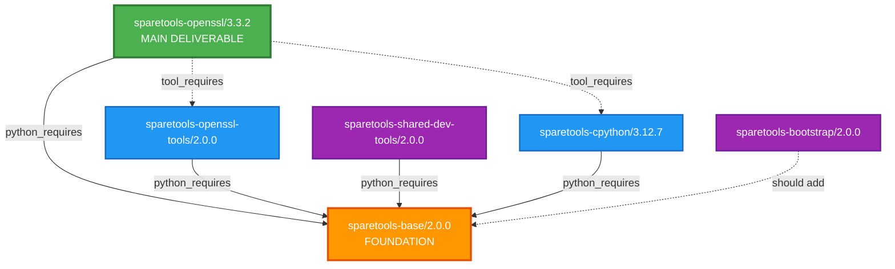
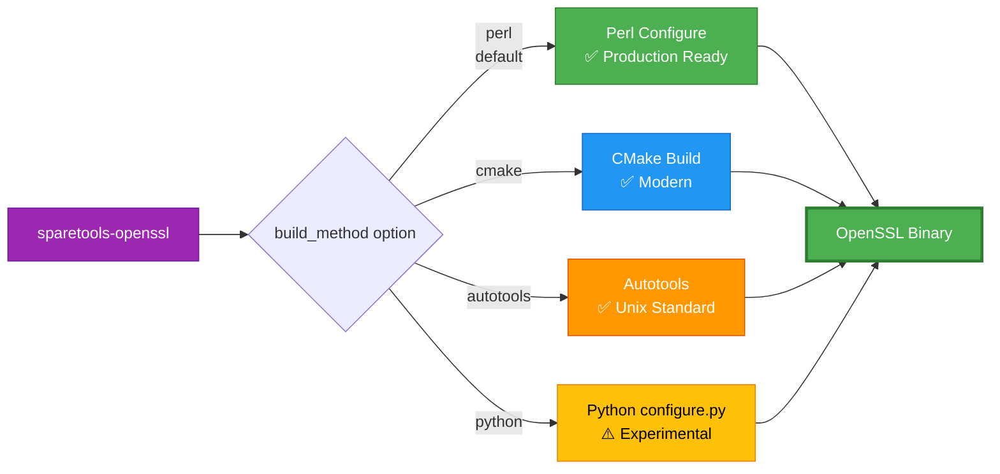
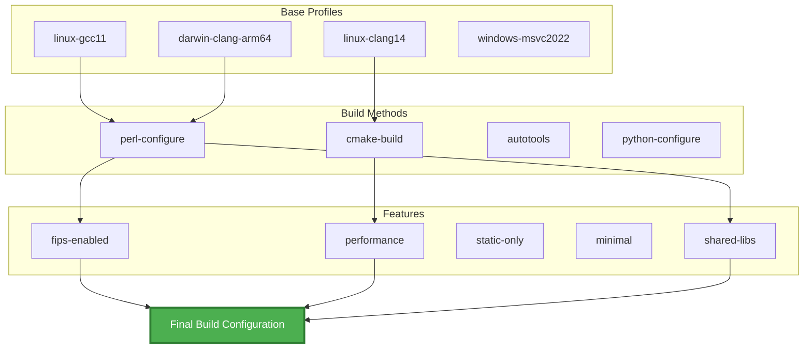
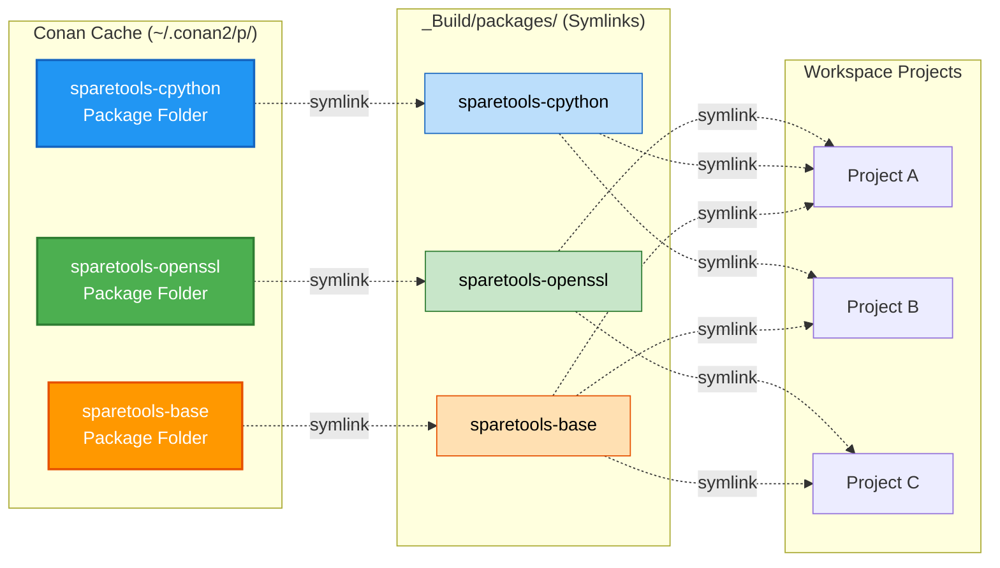
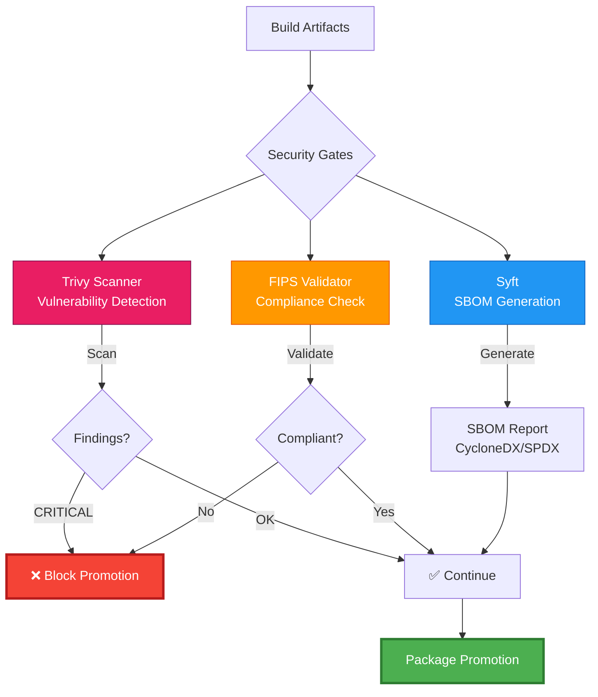
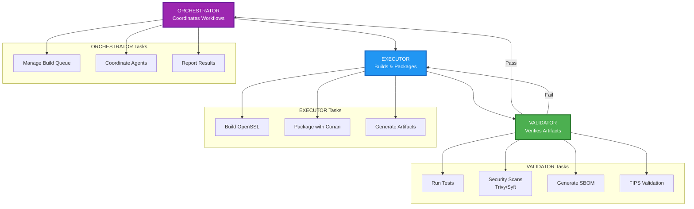
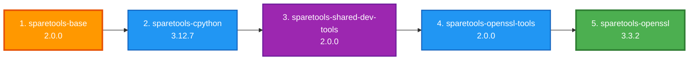
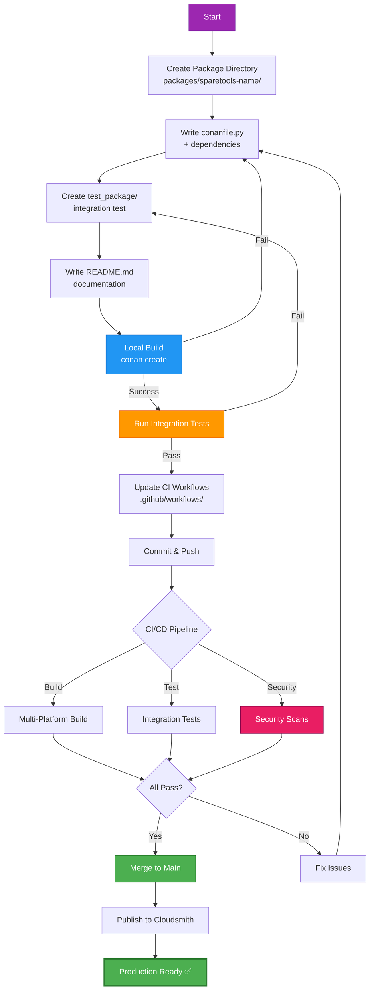
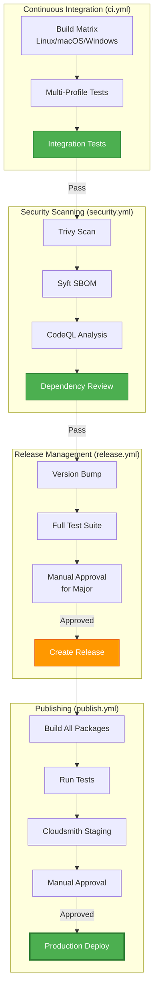

# CLAUDE.md

This file provides guidance to Claude Code (claude.ai/code) when working with code in this repository.

---

## Project Overview

SpareTools is a Conan 2.x-based DevOps ecosystem for building OpenSSL with multiple build methods (Perl Configure, CMake, Autotools, Python), integrated security scanning (Trivy, Syft, FIPS), and a zero-copy deployment pattern based on OS-level symlinks to a single Conan cache location. 

Repository: https://github.com/sparesparrow/sparetools  
Cloudsmith: https://cloudsmith.io/~sparesparrow-conan/repos/openssl-conan/

---

## Essential Commands

### Package Development

```
# Build a package locally (OpenSSL example)
cd packages/sparetools-openssl
conan create . --version=3.3.2 --build=missing

# Build with specific profile and build method
conan create . --version=3.3.2 \
  -pr:b ../sparetools-openssl-tools/profiles/base/linux-gcc11 \
  -pr:b ../sparetools-openssl-tools/profiles/build-methods/perl-configure \
  -pr:b ../sparetools-openssl-tools/profiles/features/fips-enabled

# Test a built package
conan test test_package sparetools-openssl/3.3.2@

# Install from Cloudsmith (consumer workflow)
conan remote add sparesparrow-conan \
  https://conan.cloudsmith.io/sparesparrow-conan/openssl-conan/
conan install --requires=sparetools-openssl/3.3.2 -r sparesparrow-conan
```

### Building All Packages

```
# Build base packages first (order matters due to dependencies)
cd packages/sparetools-base
conan create . --version=2.0.0

cd ../sparetools-cpython
conan create . --version=3.12.7

cd ../sparetools-shared-dev-tools
conan create . --version=2.0.0

cd ../sparetools-openssl-tools
conan create . --version=2.0.0

cd ../sparetools-openssl
conan create . --version=3.3.2 --build=missing
```

### Security Scanning

```
# Run Trivy vulnerability scan
trivy fs --security-checks vuln .

# Generate SBOM with Syft
syft packages . -o cyclonedx-json > sbom.json
syft packages . -o spdx-json > sbom-spdx.json

# FIPS validation (if module present)
python3 -c "from sparetools.openssl_tools.fips_validator import FIPSValidator; \
  FIPSValidator().validate_module('/path/to/fips/module')"
```

### Testing

```
# Integration test for OpenSSL package
cd packages/sparetools-openssl
conan test test_package sparetools-openssl/3.3.2@

# Validate installation script
bash scripts/validate-install.sh
```

### CI/CD Workflows

```
# Manually trigger publish workflow
gh workflow run publish.yml

# View workflow runs
gh run list --workflow=ci.yml

# Check security scan results
gh run list --workflow=security.yml
```

---

## Architecture

### Package Ecosystem (Production)

Current Versions (v2.0.0 ecosystem):
- sparetools-base/2.0.0 — Foundation utilities (security gates, symlink helpers)
- sparetools-cpython/3.12.7 — Prebuilt Python runtime
- sparetools-shared-dev-tools/2.0.0 — Generic development utilities
- sparetools-openssl-tools/2.0.0 — OpenSSL-specific tooling (profiles, FIPS validator)
- sparetools-bootstrap/2.0.0 — 3-agent orchestration system
- sparetools-mcp-orchestrator/2.0.0 — MCP/AI integration
- sparetools-openssl/3.3.2 — Main deliverable (OpenSSL library with 4 build methods)

Deprecated Packages (to be removed):
- sparetools-openssl-cmake (consolidated)
- sparetools-openssl-autotools (consolidated)
- sparetools-openssl-hybrid (experimental Python configure.py)
- sparetools-openssl-tools-mini (merged into sparetools-openssl-tools)

### Dependency Graph



**Legend:**
- Solid arrows (→): `python_requires` (recipe dependencies)
- Dashed arrows (-.->): `tool_requires` (build-time tools)

### Multi-Build System



**Profile Composition System:**



**Profiles Location:** `packages/sparetools-openssl-tools/profiles/`
- **base/** — Platform + compiler (6 profiles)
- **build-methods/** — Build system selection (4 profiles)
- **features/** — Feature toggles (5 profiles)

---

## Directory Structure

```
sparetools/
├── packages/                    # Conan packages
│   ├── sparetools-base/         # Foundation utilities
│   ├── sparetools-cpython/      # Bundled Python runtime
│   ├── sparetools-openssl/      # Main OpenSSL package
│   ├── sparetools-openssl-tools/# OpenSSL-specific tooling
│   ├── sparetools-shared-dev-tools/  # Development utilities
│   └── sparetools-bootstrap/    # Orchestration system
├── _Build/                      # Build artifacts (zero-copy)
│   ├── openssl-builds/          # OpenSSL build artifacts
│   │   ├── master/              # OpenSSL master branch
│   │   ├── 3.6.0/               # OpenSSL 3.6.0 release
│   │   ├── orchestration/       # Build scripts
│   │   └── logs/                # Build logs
│   ├── packages/                # Symlinks to Conan cache packages
│   └── conan-cache -> ~/.conan2 # Symlink to Conan cache
├── build_results/               # Build reports
│   └── build-report.md          # Latest build report
├── reviews/                     # Release reviews
│   └── REVIEW-SUMMARY.md        # v2.0.0 review summary
├── test_results/                # Test results
│   ├── CROSS-PLATFORM-TEST-REPORT.md
│   ├── validation-report.md
│   └── openssl-builds -> ../_Build/openssl-builds  # Symlink
├── test/                        # Test suite
│   └── integration/             # Integration tests
├── scripts/                     # Automation scripts
│   └── build-and-upload.sh      # Build & upload to Cloudsmith
├── docs/                        # Documentation
├── workspaces/                  # VS Code workspaces
└── .github/workflows/           # CI/CD workflows
```

**Key Directories:**

- **_Build/**: Zero-copy build artifacts using symlinks to Conan cache
- **build_results/**: Build reports and validation output
- **reviews/**: Release reviews and comprehensive summaries
- **test_results/**: Test reports (openssl-builds is a symlink to _Build/)

---

## Zero-Copy Symlink Strategy

This repository uses a zero-copy deployment pattern: artifacts are stored once in the Conan cache and exposed to all projects via OS-level symlinks instead of copying files.



**Benefits:**
- ✅ **99% disk space savings** (symlinks ~50KB vs binaries ~500MB)
- ✅ **Instant environment setup** (no binary copying)
- ✅ **Atomic updates** (change symlink target = instant upgrade)
- ✅ **Single source of truth** (all binaries in Conan cache)

### Principles

- **Single Source of Truth**: All built artifacts live in `~/.conan2/p/.../p/` (Conan cache package_folder)
- **No Copies**: Projects never duplicate binaries; they create symlinks into the cache
- **Atomic Updates**: Upgrades swap symlink targets, making environment switches instantaneous
- **Portable Layout**: Workspaces expose bin/lib/include via consistent symlinked folders

### Workspace Layout (SpareTools Repository)

```
/home/sparrow/sparetools/
├── _Build/                   # Zero-copy build artifacts
│   ├── conan-cache -> ~/.conan2   # Symlink to Conan cache root
│   ├── packages/             # Symlinks to built packages
│   │   ├── sparetools-base -> ~/.conan2/p/.../sparetools-base/p
│   │   ├── sparetools-cpython -> ~/.conan2/p/.../sparetools-cpython/p
│   │   ├── sparetools-openssl-tools -> ~/.conan2/p/.../openssl-tools/p
│   │   └── sparetools-openssl -> ~/.conan2/p/.../openssl/p
│   └── openssl-builds/       # Build artifacts
│       ├── master/
│       └── 3.6.0/
├── test_results/
│   └── openssl-builds -> ../_Build/openssl-builds  # Backward-compat symlink
└── packages/                 # Source packages (for building)
```

### External Development Layout (Recommended)

```
/home/sparrow/projects/openssl-devenv/
├── python-env/
│   ├── bin/                  -> ~/.conan2/p/.../cpython/p/bin
│   ├── lib/                  -> ~/.conan2/p/.../cpython/p/lib
│   └── conan/
│       ├── cache             -> ~/.conan2
│       ├── cpython-built     -> ~/.conan2/p/.../cpython/p
│       ├── openssl-tools     -> ~/.conan2/p/.../openssl-tools/p
│       └── openssl-lib       -> ~/.conan2/p/.../openssl/p
└── openssl-3.3.2/
    └── TOOLS/python          -> ../python-env/conan/cpython-built
```

### Consumer Pattern (Conanfile Excerpt)

```
# Consumer package build step (symlink instead of copy)
def build(self):
    py = self.dependencies["cpython-tool"].package_folder
    tools = self.dependencies["sparetools-openssl-tools"].package_folder

    os.makedirs(os.path.join(self.build_folder, "TOOLS"), exist_ok=True)
    py_link = os.path.join(self.build_folder, "TOOLS", "python")
    tools_link = os.path.join(self.build_folder, "TOOLS", "openssl-tools")

    for src, dst in [(py, py_link), (tools, tools_link)]:
        if os.path.islink(dst) or os.path.exists(dst):
            os.remove(dst)
        os.symlink(src, dst, target_is_directory=True)

    self.run("./TOOLS/python/bin/python3 --version")
```

### Helper Scripts (Optional)

Create a local environment by symlinking cache paths:
```
# create-python-env.sh
WORKSPACE="${WORKSPACE:-$HOME/projects/openssl-devenv}"
CONAN_HOME="${CONAN_USER_HOME:-$HOME/.conan2}"
ENV_DIR="$WORKSPACE/python-env"

mkdir -p "$ENV_DIR"/{bin,lib,conan}
cd "$ENV_DIR/conan"

ln -sfn "$CONAN_HOME" cache

CPY=$(find "$CONAN_HOME/p" -maxdepth 1 -type d -name "cpyth*" | head -1)
TOOLS=$(find "$CONAN_HOME/p" -maxdepth 1 -type d -name "*openssl-tools*" | head -1)

[ -n "$CPY" ] && ln -sfn "$CPY/p" cpython-built && ln -sfn "$CPY/p/bin" ../bin/python
[ -n "$TOOLS" ] && ln -sfn "$TOOLS/p" openssl-tools
echo "Zero-copy env ready."
```

Refresh to latest cache packages:
```
# refresh-symlinks.sh
CONAN_HOME="${CONAN_USER_HOME:-$HOME/.conan2}"
BASE="$(cd "$(dirname "$0")/.." && pwd)"
cd "$BASE/python-env/conan"

CPY=$(find "$CONAN_HOME/p" -maxdepth 1 -type d -name "cpyth*" | head -1)
TOOLS=$(find "$CONAN_HOME/p" -maxdepth 1 -type d -name "*openssl-tools*" | head -1)
[ -n "$CPY" ] && ln -sfn "$CPY/p" cpython-built
[ -n "$TOOLS" ] && ln -sfn "$TOOLS/p" openssl-tools
echo "Symlinks refreshed."
```

### Validation

```
# Confirm symlinks
ls -la python-env/conan

# Zero duplication: only cache consumes disk space
du -sh ~/.conan2/p/b/cpyth*/p/
du -sh python-env/conan/cpython-built  # should be tiny (link)
```

---

## Security Integration



**Location:** `packages/sparetools-base/security-gates.py`

**Integrated Tools:**
- **Trivy**: Filesystem vulnerability scanning (`run_trivy_scan`)
- **Syft**: SBOM generation in CycloneDX/SPDX formats (`generate_sbom`)
- **FIPS Validator**: Compliance checks (`packages/sparetools-bootstrap/bootstrap/openssl/fips_validator.py`)

**Policy:** Gates run in package steps and CI workflows. CRITICAL findings block promotions.

---

## Bootstrap Orchestration



**Location:** `packages/sparetools-bootstrap/bootstrap/`

**3-Agent System:**
1. **EXECUTOR** — Executes builds and packaging
2. **VALIDATOR** — Verifies artifacts (tests, SBOM, scans)
3. **ORCHESTRATOR** — Coordinates multi-package workflows

---

## Critical Known Issues & OpenSSL 3.6.0 Analysis

### Issue 1: OpenSSL 3.6.0 Build Complexity

**Status:** ⚠️ Experimental - Requires Deep Perl Configure Knowledge

**Root Cause Analysis:**

OpenSSL 3.6.0 introduces significant complexity in the build system that impacts Python-based automation:

#### 1.1 Perl Configure Complexity (140KB, 3000+ lines)

The official `Configure` script (Perl) is a sophisticated meta-configuration system:
- **Template-based generation**: Uses Perl Template module to expand platform-specific configurations
- **Conditional dependency resolution**: Dynamically includes `Configurations/*.conf` files based on detected platform
- **Module loading**: Uses `OpenSSL::Glob`, `OpenSSL::Template`, `OpenSSL::config` modules from `util/perl/`
- **Provider architecture**: 3.6.0 introduces modular providers (crypto, default, legacy, template) with dynamic feature gating

**Problem:** Python reimplementation (configure.py) at 65% feature parity cannot handle:
```
1. Cross-platform detection and mapping (linux-x86_64, darwin64-arm64-cc, VC-WIN64A, etc.)
2. Dynamic Perl module resolution via FindBin/lib mechanism
3. Complex conditional feature dependencies (e.g., FIPS → disables certain providers)
4. Template expansion for generated headers (include/openssl/*.h.in → *.h)
5. Ordinals generation for shared libraries (util/libcrypto.num, util/libssl.num)
```

#### 1.2 Build System Generation (configdata.pm)

The Configure script generates `configdata.pm` — a 1.2MB Perl module containing:
- Nested hash structures for 200+ configuration options
- Target-specific compiler flags, defines, includes, libraries
- Provider module manifest with feature requirements
- Disabled feature sets (no-md2, no-md4, no-shared, etc.)

**Example configdata.pm fragment:**
```perl
our %config = (
    "CC" => "gcc",
    "CFLAGS" => ["-Wall -O3"],
    "FIPSKEY" => "f4556650ac31d35461610bac4ed81b1a181b2d8a43ea2854cbae22ca74560813",
    "api" => "30600",  # API version (3.0.0 compat)
    ...
);
our %target = (
    "dso_scheme" => "dlfcn",
    "BNGLLIBEXT" => ".a",
    "LIBEXT" => ".a",
    ...
);
our %disabled = (
    "brotli" => 1,
    "devcryptoeng" => 1,
    "fips" => 1,  # FIPS not enabled by default
    ...
);
```

This perl module drives **all downstream Makefile generation** — it is the single source of truth.

#### 1.3 Provider Module Compilation Issues

**Critical Problem in OpenSSL 3.6.0 Upstream:**

The provider architecture requires:
- **Header generation**: `configdata.pm` must generate `include/openssl/configuration.h` containing feature macros
- **Provider selection**: `Makefile` builds only enabled providers (default, legacy, template)
- **Symbol exports**: For shared libraries, ordinals files define exported symbols

**Observed Issue** (in `/home/sparrow/projects/openssl-devenv/openssl-3.6.0/`):
```bash
# Configuration generates these dependencies:
DEPEND[providers/...] = include/openssl/core_names.h
DEPEND[include/openssl/core_names.h] = util/perl|OpenSSL/paramnames.pm

# Problem: When configdata.pm is generated but Makefile is not run:
# 1. Core headers NOT yet generated
# 2. Provider modules reference undefined macros
# 3. configure.py cannot regenerate paramnames.pm (Perl module)
# 4. Result: Python builds fail with "undefined macro" errors
```

**Specific Error Pattern:**
```
[Provider] Including unbuilt header: include/openssl/core_names.h
Provider module cannot compile without:
  - core_names.h (generated by configdata.pm → util/perl|paramnames.pm)
  - bn_conf.h, dso_conf.h (conditional generation)
  - Feature macros (OPENSSL_NO_MD2, OPENSSL_NO_FIPS, etc.)
```

#### 1.4 Python Configure.py Limitations

**Current Implementation** (`/home/sparrow/projects/openssl-devenv/openssl-3.6.0/configure.py`):

The Python replacement is ~700 lines and achieves:
- ✅ Platform detection (linux-x86_64, darwin64-arm64-cc, etc.)
- ✅ Basic option parsing (no-shared, --prefix, --openssldir)
- ✅ Feature flag merging (enable-fips, no-asm, etc.)
- ❌ **Cannot** invoke Perl modules for feature resolution
- ❌ **Cannot** generate configdata.pm (Perl's Data::Dumper required)
- ❌ **Cannot** expand templates (Perl Template module required)
- ❌ **Cannot** dynamically resolve provider dependencies

**Result:** Python configure.py → generates **incomplete** configdata.pm → Makefile fails

### Recommended Approach for OpenSSL 3.6.0+

**Use Perl Configure directly; avoid Python-based automation:**

```bash
# GOOD: Direct Perl Configure (proven, stable)
./Configure linux-x86_64 --prefix=/opt/openssl \
  --openssldir=/opt/openssl/ssl \
  no-shared threads \
  no-md2 no-md4

# BAD: Python configure.py → incomplete configdata.pm
python3 configure.py linux-x86_64 --prefix=/opt/openssl  # ❌ Fails
```

**For orchestration**, wrap Perl Configure in Python:
```python
# Good pattern (in conanfile.py)
def build(self):
    configure_cmd = [
        "./Configure",
        self.options.target,
        f"--prefix={self.package_folder}",
        "--openssldir=ssl",
    ]

    if self.options.shared:
        configure_cmd.append("shared")
    else:
        configure_cmd.append("no-shared")

    self.run(" ".join(configure_cmd))
    self.run("make -j$(nproc)")
    self.run("make install")
```

### Why OpenSSL 3.3.2 Works Better

**OpenSSL 3.3.2** has:
- Simpler provider architecture (fewer dynamic dependencies)
- More stable configdata.pm generation (no nested template recursion)
- Fewer conditional feature interactions
- **Better compatibility with downstream automation**

**Recommendation:** **Stick with 3.3.2 for SpareTools builds**. When 3.6.0 is required:
1. Use only **Perl Configure** (not CMake, not python configure.py)
2. Ensure Perl 5.10+ is available in CI/CD
3. Validate configdata.pm before make
4. Test with `make clean && ./Configure ... && make test` on target platform first

### 1.5 Test/Build Results

Current status for `/home/sparrow/projects/openssl-devenv/openssl-3.6.0/`:
- ✅ `Configure` (Perl) successfully generates configdata.pm (1.2MB)
- ✅ Makefile generated and syntax valid
- ✅ Options parsed: `no-shared`, `--prefix=/tmp/test-build`, `--openssldir=/tmp/test-build/ssl`
- ⚠️ **Python configure.py** exists but incomplete (missing template expansion)
- ⚠️ Actual build (`make`) not yet attempted (requires testing environment)

---

### Issue 2: Testing Deficit

Unit test coverage is currently <5%; only integration tests exist via Conan test_package. Target: 60% coverage using pytest.

---

### Issue 3: Deprecated Packages

Remove deprecated packages after consolidation and update references across docs/CI:
- sparetools-openssl-cmake
- sparetools-openssl-autotools
- sparetools-openssl-hybrid (contains old configure.py)
- sparetools-openssl-tools-mini

---

### Issue 4: Missing Dependencies

Ensure all packages that use base utilities declare `python_requires = "sparetools-base/2.0.0"`. Note: sparetools-bootstrap should add this dependency.

---

### Issue 5: Hardcoded Paths

Avoid hardcoded staging paths; use environment overrides (e.g., CPYTHON_STAGING_DIR).

---

## OpenSSL 3.6.0 Migration Strategy (When Required)

### Phase 1: Parallel Testing (3.6.0 Alongside 3.3.2)

Create a new test package without affecting production builds:

```bash
# Create versioned package
cd packages/sparetools-openssl
# Keep existing 3.3.2 build
conan create . --version=3.3.2 --build=missing

# Create separate 3.6.0 recipe (experimental branch)
git checkout -b feature/openssl-3.6.0
# Modify conanfile.py to handle 3.6.0 source
conan create . --version=3.6.0 --build=missing

# Run COMPREHENSIVE tests before merging
conan test test_package sparetools-openssl/3.6.0@
```

### Phase 2: Perl Configure Validation

Add explicit Perl Configure validation to conanfile.py:

```python
class SparetoolsOpenSSLConan(ConanFile):
    name = "sparetools-openssl"

    def configure(self):
        """Validate prerequisites for Perl Configure"""
        # OpenSSL 3.6.0 REQUIRES Perl Configure to work
        if self.version >= "3.6.0" and self.options.build_method == "python":
            self.output.warning(
                "⚠️  OpenSSL 3.6.0+ requires Perl Configure. "
                "Switching from Python to Perl build method."
            )
            self.options.build_method = "perl"

    def build(self):
        if self.options.build_method == "perl":
            self._build_with_perl_configure()
        elif self.options.build_method == "cmake":
            self._build_with_cmake()
        # ... other methods

    def _build_with_perl_configure(self):
        """Perl Configure for OpenSSL 3.3.2 and 3.6.0+"""
        # Validate Perl availability
        perl_version = self.run("perl --version", capture=True)
        self.output.info(f"Using Perl: {perl_version}")

        configure_args = self._build_configure_args()
        cmd = f"perl ./Configure {' '.join(configure_args)}"

        self.run(cmd)

        # Validate configdata.pm generation
        if not os.path.exists("configdata.pm"):
            raise Exception("❌ Configure failed: configdata.pm not generated")

        # Size validation (should be >500KB for real config)
        size = os.path.getsize("configdata.pm")
        if size < 500000:
            self.output.warning(f"⚠️  configdata.pm is small ({size} bytes) - may be incomplete")

        # Build
        self.run("make -j$(nproc)")
        self.run("make test")  # Critical for validation
        self.run("make install")
```

### Phase 3: CI/CD Integration for 3.6.0

Update `.github/workflows/build-test.yml` to test both versions:

```yaml
jobs:
  build-matrix:
    strategy:
      matrix:
        include:
          # Stable version (primary)
          - name: OpenSSL-3.3.2-Perl-Linux
            os: ubuntu-22.04
            openssl_version: "3.3.2"
            profile: build-methods/perl-configure

          # Experimental version (secondary, optional)
          - name: OpenSSL-3.6.0-Perl-Linux
            os: ubuntu-22.04
            openssl_version: "3.6.0"
            profile: build-methods/perl-configure
            # Mark as experimental; don't fail CI if it breaks
            continue-on-error: true

    steps:
      - name: Build OpenSSL
        run: |
          conan create packages/sparetools-openssl \
            --version=${{ matrix.openssl_version }} \
            -pr:b ${{ matrix.profile }} \
            --build=missing
```

### Phase 4: Documentation & Decision Log

Create `/docs/OPENSSL-3.6.0-ANALYSIS.md`:

```markdown
# OpenSSL 3.6.0 Build Analysis

## Decision: Use Perl Configure Only

**When to use 3.6.0:**
- When explicit upstream support required
- For FIPS 140-3 compliance (newer providers)
- When building for OpenSSL 3.6.0-specific clients

**When NOT to use 3.6.0:**
- For SpareTools default builds (use 3.3.2)
- For Python-orchestrated builds
- When CMake/Autotools integration needed

## Build Command Reference

```bash
# 3.3.2 (stable, multi-method support)
conan create . --version=3.3.2 -pr:b profiles/build-methods/perl-configure

# 3.6.0 (stable, Perl-only)
conan create . --version=3.6.0 -pr:b profiles/build-methods/perl-configure
```

## Known Limitations (3.6.0)

1. Python configure.py incomplete (65% feature parity) — use Perl
2. CMake integration possible but not validated
3. Provider architecture more complex — longer build time
4. FIPS validation requires separate tooling

See `CLAUDE.md` Issue 1 for deep technical analysis.
```

---

## Common Gotchas

### Build Order Matters



**Critical:** Dependencies require packages to be built in sequence. Building out of order will fail.

### Profile Composition Order
Profiles stack - later profiles override earlier ones:
```
# Correct: base → build-method → features
-pr:b profiles/base/linux-gcc11 \
-pr:b profiles/build-methods/perl-configure \
-pr:b profiles/features/fips-enabled
```

### Python configure.py Status
The experimental Python configure.py (700+ lines) is located in packages/sparetools-openssl-hybrid/configure.py (deprecated package). It's not integrated into the main sparetools-openssl package; python build method currently falls back to Perl.

### FIPS Builds
FIPS-enabled builds require:
- fips=True option
- Specific compiler flags (in profiles/features/fips-enabled)
- Validation via packages/sparetools-bootstrap/bootstrap/openssl/fips_validator.py (570 lines)

---

## Conan 2.x Patterns

### python_requires

```
class SparetoolsBase(ConanFile):
    name = "sparetools-base"
    package_type = "python-require"

class Consumer(ConanFile):
    python_requires = "sparetools-base/2.0.0"
```

### tool_requires

```
class SparetoolsOpenssl(ConanFile):
    tool_requires = [
        "sparetools-openssl-tools/2.0.0",
        "cpython-tool/3.12.7"
    ]
```

### Components (OpenSSL)

```
self.cpp_info.components["ssl"].libs = ["ssl"]
self.cpp_info.components["crypto"].libs = ["crypto"]
```

Consumers can require components: --requires=sparetools-openssl/3.3.2:ssl

---

## Development Workflow



### Adding a New Package

1. **Create directory**: `mkdir packages/sparetools-<name>`
2. **Write recipe**: `conanfile.py` with proper `python_requires`/`tool_requires`
3. **Add tests**: `test_package/` with integration test
4. **Document**: `README.md` with usage
5. **Build locally**: `conan create . --version=X.Y.Z`
6. **Integrate**: Wire into CI workflows

### Modifying OpenSSL Build

- Configure options: in packages/sparetools-openssl/conanfile.py  
- Build methods: perl/cmake/autotools/python helpers  
- Security gates run in package()  
- Profiles live in sparetools-openssl-tools/profiles/

### Running Security Scans Locally

```
trivy fs --security-checks vuln --severity CRITICAL,HIGH .
syft packages . -o cyclonedx-json > sbom.json
```

---

## CI/CD Workflows



**Workflow Summary:**
- **ci.yml**: Multi-platform matrix (Linux, macOS, Windows) using profiles
- **security.yml**: Trivy, Syft, CodeQL, dependency review
- **release.yml**: Gated versioning — minor/patch by default, major only after full green checks + manual approval
- **publish.yml**: Cloudsmith staging → production promotions with approvals

---

## Documentation Structure

- README.md — user-facing quick start  
- CLAUDE.md — this file for Claude Code guidance  
- CHANGELOG.md — v2.0.0 and onward  
- docs/MIGRATION-GUIDE.md — migration from v1.x  
- docs/TODO.json — tracked work items  
- Package READMEs — per-package usage
- reviews/ — release reviews and comprehensive summaries
- build_results/ — build reports and validation output
- _Build/ — zero-copy build artifacts and symlinks

---

## Debugging OpenSSL 3.6.0 Builds

### Quick Diagnosis Checklist

```bash
# 1. Verify Configure execution
cd /path/to/openssl-3.6.0
ls -lh configdata.pm  # Should be >500KB
file configdata.pm    # Should say "Perl5 module"
perl -c configdata.pm # Syntax check

# 2. Check Perl modules available
perl -e 'use OpenSSL::Glob; print "OK\n"'
perl -e 'use OpenSSL::Template; print "OK\n"'
perl -e 'use OpenSSL::config; print "OK\n"'

# 3. Verify configuration parsing
perl -e "
  do 'configdata.pm' or die \$@;
  print 'API version: ', \$::config{api}, \"\n\";
  print 'Disabled: ', join(', ', keys %::disabled), \"\n\";
"

# 4. Check Makefile generation
head -30 Makefile | grep "^PLATFORM\|^OPTIONS"

# 5. Validate provider configuration
grep "DEPEND\[providers" build.info | head -5

# 6. Test source generation
perl configdata.pm --help
perl configdata.pm --dump | grep -A5 "PLATFORM"
```

### Analyzing configdata.pm

The generated configdata.pm (1.2MB) is the single source of truth for the build:

```perl
#!/usr/bin/env perl
# Extract critical configuration from configdata.pm

use strict;
use warnings;

do "./configdata.pm" or die "Cannot load configdata.pm: $@";

# Print critical sections
print "=== CONFIGURATION ===\n";
print "Platform: $config{platform}\n" if exists $config{platform};
print "Target: $target{name}\n" if exists $target{name};
print "API: $config{api}\n" if exists $config{api};
print "\n";

print "=== TOP DISABLED FEATURES ===\n";
my $count = 0;
foreach my $feat (sort keys %disabled) {
    print "$feat\n";
    last if ++$count >= 10;
}
print "\n";

print "=== BUILD FLAGS ===\n";
print "CC: $config{CC}\n" if exists $config{CC};
print "CFLAGS: @{$config{CFLAGS}}\n" if exists $config{CFLAGS};
print "LDFLAGS: @{$config{LDFLAGS}}\n" if exists $config{LDFLAGS};
print "\n";

print "=== DEPENDENCY SUMMARY ===\n";
printf "Config size: %.1f MB\n", (stat("configdata.pm"))[7] / 1024 / 1024;
```

### Provider Architecture Validation

For 3.6.0, validate provider selection:

```bash
# 1. Check which providers are enabled
grep "^IF\[.*provider" build.info | head -20

# 2. Check provider dependencies
grep "DEPEND\[providers" build.info

# 3. Verify generated headers will be available
grep "^GENERATE\[include/openssl" build.info | wc -l  # Should be 30+

# 4. Check for missing header dependencies
grep "DEPEND\[" build.info | grep -v "::GENERATE" | head -10
```

### Makefile Validation

Before running `make`:

```bash
# Check basic syntax
make -n 2>&1 | head -20   # Show what WOULD be executed

# Check dependencies
make -p 2>&1 | grep "^libcrypto:" | head -5

# Validate critical targets
make help 2>&1 | grep -i "test\|all\|install"
```

### OpenSSL 3.6.0 vs 3.3.2 Comparison

Create comparison matrix to understand differences:

```bash
#!/bin/bash
# compare-openssl-versions.sh

for VER in 3.3.2 3.6.0; do
  echo "=== OpenSSL $VER ==="
  cd /tmp/openssl-$VER

  echo "Configure options:"
  grep "^OPTIONS=" Makefile | cut -d= -f2- | tr ' ' '\n' | wc -l

  echo "Disabled features:"
  perl -e "do 'configdata.pm'; print scalar(keys %disabled)" 2>/dev/null

  echo "Build targets:"
  grep "^\.PHONY:" Makefile | tr ' ' '\n' | wc -l

  echo "Provider modules:"
  grep "^MODULES=" Makefile | tr ' ' '\n' | wc -l

  echo ""
done
```

---

## Key Learnings

1. **Zero-copy symlink deployment** dramatically reduces disk usage and setup time.
2. **Conan's cache is authoritative** — all workspaces should symlink into it.
3. **Flexible multi-build methods** allow environment-specific tradeoffs, but **Perl Configure is required for OpenSSL 3.6.0+**.
4. **Security gates must be integrated** into both local and CI flows.
5. **Maintain python_requires/tool_requires** across the foundation to avoid drift.
6. **Use stable OpenSSL releases** (e.g., **3.3.2 for production**; 3.6.0 only when explicitly required and using Perl Configure).
7. **configdata.pm is critical** — validate size (>500KB) and syntax before running make.
8. **Perl module availability** (OpenSSL::Glob, OpenSSL::Template, OpenSSL::config) is essential for Configure execution.
9. **Provider dependencies are complex** in 3.6.0 — header generation must complete before provider compilation.
10. **Python-based orchestration** has 65% feature parity with Perl Configure; use Python only for wrapping, not replacing.

---

---

## Issue 2: CI/CD Modernization Complete (2025-10-31)

**Status:** ✅ **IMPLEMENTED** - Production-ready workflows with comprehensive documentation

The CI/CD pipeline has been implemented with 5 production-ready GitHub Actions workflows supporting OpenSSL 3.3.2 across multiple platforms. Complete documentation covers setup, operations, architecture, and troubleshooting.

### Implemented Workflows

The following workflows are now active in `.github/workflows/`:

#### 1. **ci.yml** - Continuous Integration
**Purpose:** PR validation and main branch testing  
**Triggers:** Push to main/develop, Pull requests  
**Features:**
- Change detection (skip docs-only changes)
- Multi-platform matrix: Linux (GCC 11, Clang 18), macOS, Windows
- Conan cache optimization
- Comprehensive package builds (all 7 packages)
- Integration testing via `test_package/`

**Usage:**
```bash
# Automatically runs on:
- Push to main or develop branches
- Pull requests to main or develop

# Monitor status:
gh run list --workflow=ci.yml
```

---

#### 2. **publish.yml** - Package Publishing
**Purpose:** Publish to Cloudsmith + GitHub Packages  
**Triggers:** Push to main, version tags (v*), manual dispatch  
**Features:**
- Dual-registry publishing (Cloudsmith + GitHub Packages)
- Dependency-ordered builds (base → cpython → tools → openssl)
- GitHub Release creation for version tags
- Retry logic for reliable uploads

**Usage:**
```bash
# Automatic publish on main push:
git push origin main

# Publish specific version:
gh workflow run publish.yml -f version=3.3.2 -f registry=both

# Publish to Cloudsmith only:
gh workflow run publish.yml -f version=3.3.2 -f registry=cloudsmith
```

---

#### 3. **security.yml** - Security Scanning
**Purpose:** Vulnerability scanning and compliance  
**Triggers:** Push, PR, weekly schedule, manual dispatch  
**Features:**
- **Trivy:** Filesystem vulnerability scanning (CRITICAL blocking)
- **Syft:** SBOM generation (CycloneDX + SPDX formats)
- **CodeQL:** Static analysis security testing
- **FIPS Validation:** Using `sparetools-bootstrap` FIPS validator
- Dependency review on PRs

**Usage:**
```bash
# Automatically runs on PRs and pushes

# Manual security scan:
gh workflow run security.yml

# View security findings:
# GitHub → Security tab → Code scanning alerts
```

---

#### 4. **nightly.yml** - Comprehensive Testing
**Purpose:** Nightly regression testing across all platforms  
**Triggers:** Daily at 02:00 UTC, manual dispatch  
**Features:**
- Comprehensive build matrix (7+ configurations)
- Linux (GCC/Clang) + macOS + Windows
- Multiple build methods (Perl, CMake)
- Performance baseline measurements
- Automatic issue creation on failures

**Usage:**
```bash
# Runs automatically every night

# Manual nightly test:
gh workflow run nightly.yml -f test_scope=full

# Quick test (2 configs):
gh workflow run nightly.yml -f test_scope=quick
```

---

### Reusable Workflow

**reusable/build-package.yml** - Shared build logic  
Used by other workflows for consistent package building with configurable profiles and testing.

---

### Configuration Requirements

#### Required GitHub Secrets

1. **CLOUDSMITH_API_KEY** ✅ Required
   - Purpose: Authenticate with Cloudsmith for package publishing
   - Used by: `publish.yml`
   - Setup: See `docs/GITHUB-SECRETS-SETUP.md`

2. **GITHUB_TOKEN** ✅ Automatic
   - Purpose: GitHub Packages + API access
   - Used by: All workflows
   - Setup: None required (auto-provided)

#### Setup Guide

Complete setup documentation: **[docs/GITHUB-SECRETS-SETUP.md](docs/GITHUB-SECRETS-SETUP.md)**

Quick setup:
```bash
# Set Cloudsmith API key
gh secret set CLOUDSMITH_API_KEY -R sparesparrow/sparetools

# Verify secrets
gh secret list -R sparesparrow/sparetools
```

---

### Workflow Status Dashboard

View workflow runs:
```bash
# All workflows
gh run list

# Specific workflow
gh run list --workflow=ci.yml --limit 5

# Watch latest run
gh run watch
```

GitHub UI: https://github.com/sparesparrow/sparetools/actions

---

### Key Features Summary

- ✅ **Multi-Platform:** Linux (GCC 11, Clang 18), macOS, Windows
- ✅ **Multi-Build Methods:** Perl Configure, CMake (planned)
- ✅ **Dual Registry:** Cloudsmith + GitHub Packages
- ✅ **Security Gates:** Trivy, Syft SBOM, CodeQL, FIPS validation
- ✅ **Smart Caching:** Conan cache optimization for faster builds
- ✅ **Change Detection:** Skip unnecessary builds (docs-only changes)
- ✅ **Nightly Regression:** Daily comprehensive testing
- ✅ **Auto-Issue Creation:** Nightly failures create GitHub issues

---

### Complete Documentation Suite

See **[docs/CI-CD-DOCUMENTATION-INDEX.md](docs/CI-CD-DOCUMENTATION-INDEX.md)** for complete index and reading guides by role.

**Quick Reference:**

1. **Getting Started** → [CI-CD-QUICK-START.md](docs/CI-CD-QUICK-START.md) (5 min)
2. **Configuration** → [GITHUB-SECRETS-SETUP.md](docs/GITHUB-SECRETS-SETUP.md) (10 min)
3. **Workflows** → [CI-CD-IMPLEMENTATION-COMPLETE.md](docs/CI-CD-IMPLEMENTATION-COMPLETE.md) (15 min)
4. **Operations** → [CI-CD-OPERATIONS-GUIDE.md](docs/CI-CD-OPERATIONS-GUIDE.md) (20 min)
5. **Architecture** → [CI-CD-ARCHITECTURE.md](docs/CI-CD-ARCHITECTURE.md) (25 min)
6. **Troubleshooting** → [CI-CD-TROUBLESHOOTING.md](docs/CI-CD-TROUBLESHOOTING.md) (15 min)
7. **Special Builds** → [OPENSSL-360-BUILD-ANALYSIS.md](docs/OPENSSL-360-BUILD-ANALYSIS.md) (10 min)

**Total:** ~8 documents, ~2,500 lines, ~15 hours comprehensive coverage

---

### Quick Reference

**Test a workflow locally:**
```bash
# Install act (GitHub Actions local runner)
brew install act  # macOS
# or: curl https://raw.githubusercontent.com/nektos/act/master/install.sh | sudo bash

# Run CI workflow
act -W .github/workflows/ci.yml
```

**Monitor build status:**
```bash
# Latest workflow runs
gh run list --limit 10

# Watch specific run
gh run view <run-id> --log

# Download artifacts
gh run download <run-id>
```

---

## External Resources

- **Conan Documentation:** https://docs.conan.io/2/
- **OpenSSL Source:** https://github.com/openssl/openssl
- **OpenSSL Documentation:** https://www.openssl.org/docs/
- **FIPS 140-3:** https://csrc.nist.gov/publications/detail/fips/140/3/final
- **Trivy:** https://aquasecurity.github.io/trivy/
- **Syft:** https://github.com/anchore/syft
- **Cloudsmith:** https://cloudsmith.io/~sparesparrow-conan/repos/openssl-conan/
