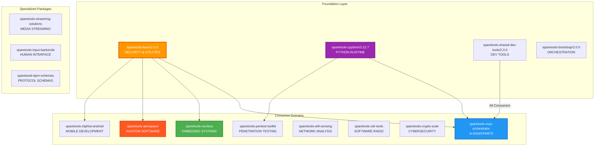
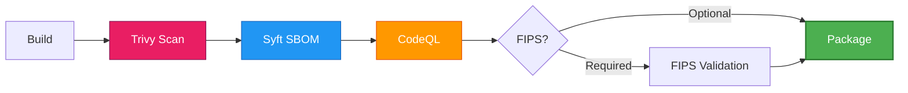
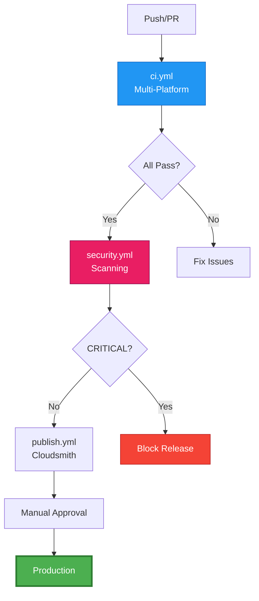

# SpareTools Multi-Domain Package Ecosystem

[](https://github.com/sparesparrow/sparetools/actions)
[](https://github.com/sparesparrow/sparetools/actions)
[](LICENSE)
[](https://conan.io)
[](https://www.python.org)

Comprehensive Conan 2.x ecosystem spanning embedded systems, AI/ML, cybersecurity, aerospace, and enterprise applications with hermetic builds, security-first architecture, and zero-copy deployment.

---

## 🚀 Quick Start (5 minutes)

### Install from Cloudsmith

```bash
# Add remote (one-time)
conan remote add sparesparrow-conan \
  https://dl.cloudsmith.io/public/sparesparrow-conan/sparetools/

# Install Python runtime (foundation)
conan install --tool-requires=sparetools-cpython/3.12.7 --build=missing

# Install AI assistant tools (MCP ecosystem)
conan install --requires=sparetools-mcp-orchestrator/2.0.3 --build=missing

# Install embedded development tools (ESP32)
conan install --requires=sparetools-nucleus/2.0.0 --build=missing

# Install cybersecurity toolkit
conan install --requires=sparetools-pentest-toolkit/2.0.0 --build=missing
```

### Build from Source

```bash
# Build foundation layer
conan create packages/foundation/sparetools-base --version=2.0.3 --build=missing
conan create packages/foundation/sparetools-cpython --version=3.12.7 --build=missing

# Build AI/ML ecosystem (MCP)
conan create packages/consumers/mcp/sparetools-mcp-orchestrator --version=2.0.3 --build=missing

# Build embedded systems (ESP32)
conan create packages/consumers/esp32/sparetools-nucleus --version=2.0.0 --build=missing

# Build cybersecurity tools
conan create packages/pentest/sparetools-pentest-toolkit --version=2.0.0 --build=missing
```

---

## 📋 Repository Separation Notice

**December 2025**: SpareTools has evolved into a comprehensive multi-domain package ecosystem spanning AI/ML, embedded systems, cybersecurity, aerospace, and enterprise applications. The original OpenSSL focus has been integrated as one of many consumer domains.

### Package Distribution
- **Primary Registry**: Cloudsmith (sparesparrow-conan/sparetools)
- **Legacy OpenSSL**: Available in [dedicated openssl-conan repository](https://github.com/sparesparrow/openssl-conan)
- **Domain-Specific**: Specialized packages for each technology domain

### Migration Guide
For existing OpenSSL-focused users:
```bash
# Add primary SpareTools remote (includes all domains)
conan remote add sparesparrow-conan \
  https://dl.cloudsmith.io/public/sparesparrow-conan/sparetools/

# For legacy OpenSSL-only usage
conan remote add sparesparrow-openssl \
  https://dl.cloudsmith.io/public/sparesparrow-conan/openssl-conan/
```

---

## 🚀 Install CLI Tools (Zipapps)

For quick access to SpareTools CLI utilities without full environment setup, use our Python zipapp distributions:

```bash
# Install bootstrap tool (multi-domain project templating)
curl -s https://api.github.com/repos/sparesparrow/sparetools/releases/latest | \
  sed -n 's/"browser_download_url": //p' | \
  grep 'sparetools-bootstrap\.pyz' | \
  xargs wget -qO sparetools-bootstrap.pyz

chmod +x sparetools-bootstrap.pyz
sudo mv sparetools-bootstrap.pyz /usr/local/bin/sparetools-bootstrap

# Now use it
sparetools-bootstrap --help
sparetools-bootstrap --template=mcp --name=my-ai-project
sparetools-bootstrap --template=esp32 --name=my-embedded-project
sparetools-bootstrap --template=aerospace --name=my-avionics-project
```

**Available zipapps**: bootstrap, MCP servers, embedded tools, cybersecurity utilities, and domain-specific generators. See [Zipapp Distribution](docs/ZIPAPP-DISTRIBUTION.md) for complete list.

---

## 📊 Architecture at a Glance

### Multi-Domain Package Ecosystem



### Package Categories

**Foundation Layer:**
- `sparetools-base`: Core utilities, security gates, zero-copy patterns
- `sparetools-cpython`: Prebuilt Python 3.12.7 runtime environment
- `sparetools-bootstrap`: Multi-domain project orchestration

**Consumer Domains:**
- **AI/ML**: MCP orchestrator, prompt systems, AI assistants
- **Embedded**: ESP32, aerospace, IoT devices
- **Mobile**: Android JNI, cross-platform development
- **Security**: Cryptography, penetration testing, network analysis
- **Media**: Streaming solutions, audio/video processing
- **Input**: Gamepad mapping, human interface devices

---

## ✨ Key Features

### Zero-Copy Deployment
```
~/.conan2/p/openssl/   → 500 MB (single copy)
_Build/packages/       → 50 KB (symlinks)
workspace/lib/         → 50 KB (symlinks)
────────────────────────────────────────────
Traditional copies:    1.5 GB
With symlinks:         500 MB
Savings:              ✅ 66% (1 GB saved)
```

### Multi-Platform Support
| Platform | Compiler | Status |
|----------|----------|--------|
| Linux | GCC 11+ | ✅ Stable |
| Linux | Clang 14+ | ✅ Stable |
| macOS | Apple Clang | ✅ Stable |
| Windows | MSVC 2022 | ⚠️ Experimental |

### Security Integration


---

## 📦 Package Overview

### Foundation & Infrastructure (9 packages)
| Package | Version | Purpose |
|---------|---------|---------|
| **sparetools-base** | 2.0.0 | Core utilities, security gates, zero-copy patterns |
| **sparetools-cpython** | 3.12.7 | Prebuilt Python 3.12.7 runtime environment |
| **sparetools-bootstrap** | 2.0.0 | Multi-domain project orchestration framework |
| **sparetools-shared-dev-tools** | 2.0.0 | Development utilities and build helpers |
| **sparetools-test-harness** | 2.0.0 | Testing infrastructure and frameworks |
| **sparetools-recipe-base** | 2.0.0 | Base Conan recipes and templates |
| **sparetools-icd** | 2.0.0 | Interface control documents and schemas |

### Consumer Domains (15+ packages)
| Domain | Key Packages | Purpose |
|--------|--------------|---------|
| **AI/ML** | `sparetools-mcp-orchestrator`<br/>`sparetools-mcp-servers`<br/>`sparetools-prompt-system` | Model Context Protocol, AI assistants, prompt engineering |
| **Embedded** | `sparetools-nucleus`<br/>`sparetools-bpm-detector`<br/>`sparetools-hal-sunton` | ESP32 development, IoT, real-time systems |
| **Aerospace** | `sparetools-aerospace` | Aviation software and avionics systems |
| **Mobile** | `sparetools-cliphist-android` | Android JNI integration and mobile development |
| **Security** | `sparetools-pentest-toolkit`<br/>`sparetools-crypto-suite` | Penetration testing, cryptography, network security |
| **Networking** | `sparetools-wifi-sensing`<br/>`sparetools-streaming-solutions` | WiFi analysis, media streaming, network tools |
| **SDR** | `sparetools-sdr-tools` | Software-defined radio applications |
| **Input** | `sparetools-input-backends`<br/>`sparetools-gamepad-*` | Human interface devices, game controllers |

### Specialized & Legacy (10+ packages)
| Category | Examples | Purpose |
|----------|----------|---------|
| **Schemas** | `sparetools-bpm-schemas`<br/>`sparesparrow-protocols` | Protocol definitions, data schemas |
| **OpenSSL** | `sparetools-openssl`<br/>`sparetools-openssl-tools` | Cryptographic libraries (legacy domain) |
| **Python Tools** | `sparetools-py`<br/>`sparetools-proc-tools`<br/>`sparetools-fs-tools` | Python utilities and system tools |

→ **Complete package reference:** [docs/PACKAGES.md](docs/PACKAGES.md)

---

## 🎯 Common Tasks

### Building Foundation Packages

```bash
# Build core infrastructure
conan create packages/foundation/sparetools-base --version=2.0.0 --build=missing
conan create packages/foundation/sparetools-cpython --version=3.12.7 --build=missing

# Build development tools
conan create packages/foundation/sparetools-shared-dev-tools --version=2.0.0 --build=missing
conan create packages/foundation/sparetools-bootstrap --version=2.0.0 --build=missing
```

### Building Consumer Packages

```bash
# AI/ML ecosystem
conan create packages/consumers/mcp/sparetools-mcp-orchestrator --version=2.0.3 --build=missing

# Embedded systems
conan create packages/consumers/esp32/sparetools-nucleus --version=2.0.0 --build=missing

# Cybersecurity tools
conan create packages/pentest/sparetools-pentest-toolkit --version=2.0.0 --build=missing

# Aerospace software
conan create packages/aerospace/sparetools-aerospace --version=2.0.0 --build=missing
```

### Testing

```bash
# Run integration test
conan test packages/sparetools-openssl/test_package \
  sparetools-openssl/3.3.2

# Run unit tests
pytest test/unit/ -v

# With coverage
pytest test/unit/ --cov=packages/sparetools-base --cov-report=html
```

### Security Scanning

```bash
# Comprehensive vulnerability scan
trivy fs --security-checks vuln --scanners vuln .

# Generate SBOM for entire ecosystem
syft packages . -o cyclonedx-json > sparetools-sbom.json

# FIPS validation for cryptographic packages
python3 -c "from sparetools_base.security.fips_validator import FIPSValidator; \
  FIPSValidator().validate_packages(['sparetools-crypto-suite', 'sparetools-openssl'])"

# CodeQL security analysis
codeql database create --language=python --source-root=. codeql-db
codeql database analyze codeql-db --format=sarif-latest --output=security-results.sarif
```

### Publishing

```bash
# Build foundation layer first
conan create packages/foundation/sparetools-base --version=2.0.0 --build=missing
conan create packages/foundation/sparetools-cpython --version=3.12.7 --build=missing

# Build and publish consumer domains
for domain in mcp esp32 aerospace android wifi sdr security; do
  echo "Building $domain consumer packages..."
  # Build domain-specific packages
  conan create "packages/consumers/$domain/*" --version=2.0.0 --build=missing
done

# Upload all packages to Cloudsmith (requires CLOUDSMITH_API_KEY)
conan upload "sparetools-*/*" -r sparesparrow-conan --confirm --parallel=4
```

→ **More examples:** [docs/QUICK-REFERENCE.md](docs/QUICK-REFERENCE.md)

---

## 📚 Documentation

### Getting Started
- **[Quick Reference](docs/QUICK-REFERENCE.md)** - Commands and options cheat sheet (5 min)
- **[Architecture Overview](docs/ARCHITECTURE.md)** - Comprehensive system design and domains (15 min)
- **[Testing Guide](docs/TESTING-GUIDE.md)** - Multi-domain testing procedures

### Consumer Domain Guides
- **[MCP Ecosystem Guide](mcp/README.md)** - AI assistants and Model Context Protocol
- **[ESP32 Development](docs/consumers/esp32/README.md)** - Embedded systems and IoT
- **[Aerospace Integration](packages/aerospace/sparetools-aerospace/README.md)** - Aviation software development
- **[Android Development](packages/consumers/android/sparetools-cliphist-android/README.md)** - Mobile and JNI integration
- **[Cybersecurity Toolkit](packages/pentest/sparetools-pentest-toolkit/README.md)** - Penetration testing and security

### Operations
- **[Publishing Guide](docs/PUBLISHING-GUIDE.md)** - Multi-domain package publishing
- **[CI/CD Guide](docs/CI-CD-GUIDE.md)** - GitHub Actions workflows and operations
- **[CI/CD Troubleshooting](docs/CI-CD-TROUBLESHOOTING.md)** - Common workflow issues
- **[GitHub Secrets Setup](docs/GITHUB-SECRETS-SETUP.md)** - Configure CI/CD secrets

### Reference
- **[Package Reference](docs/PACKAGES.md)** - Complete ecosystem documentation
- **[Migration Guide](docs/MIGRATION-GUIDE.md)** - Upgrade from v1.x to v2.0.0
- **[Security Architecture](docs/ENTERPRISE-SECURITY.md)** - Security gates and compliance
- **[Performance Guide](docs/ASSEMBLY-OPTIMIZATIONS.md)** - Optimization and performance tuning
- **[Workspace Guide](docs/WORKSPACE-GUIDE.md)** - VS Code and development environment setup
- **[Zipapp Distribution](docs/ZIPAPP-DISTRIBUTION.md)** - CLI tools and distribution

### Changelog
- **[CHANGELOG.md](CHANGELOG.md)** - Version history and breaking changes
- **[CONTRIBUTING.md](CONTRIBUTING.md)** - How to contribute

---

## 🏗️ CI/CD Pipeline



**Active Workflows:**
- `ci.yml` - Multi-platform builds (Linux, macOS, Windows)
- `security.yml` - Trivy, Syft, CodeQL, FIPS validation
- `publish.yml` - Cloudsmith + GitHub Packages publishing
- `nightly.yml` - Daily comprehensive regression testing
- `release.yml` - Version management and releases

→ **Details:** [docs/CI-CD-GUIDE.md](docs/CI-CD-GUIDE.md)

---

## 🤝 Support & Community

- **Issues:** [GitHub Issues](https://github.com/sparesparrow/sparetools/issues)
- **Discussions:** [GitHub Discussions](https://github.com/sparesparrow/sparetools/discussions)
- **Documentation:** [Complete Documentation](docs/README.md)
- **Packages:** [Cloudsmith Registry](https://cloudsmith.io/~sparesparrow-conan/repos/sparetools/)
- **CI/CD:** [GitHub Actions](https://github.com/sparesparrow/sparetools/actions)
- **Domain-Specific:** Check individual package READMEs for specialized support

---

## 📄 License

Apache License 2.0 - see [LICENSE](LICENSE) for details.

---

## 🎉 Quick Links

| Resource | Description |
|----------|-------------|
| [Complete Package Reference](docs/PACKAGES.md) | All 40+ packages across domains |
| [Architecture Overview](docs/ARCHITECTURE.md) | Multi-domain system design |
| [MCP Ecosystem](mcp/README.md) | AI assistants and protocol servers |
| [ESP32 Development](docs/consumers/esp32/README.md) | Embedded systems guide |
| [Security Architecture](docs/ENTERPRISE-SECURITY.md) | Security gates and compliance |
| [Publishing Guide](docs/PUBLISHING-GUIDE.md) | Multi-domain publishing workflows |
| [CI/CD Operations](docs/CI-CD-GUIDE.md) | Workflow management and automation |
| [Testing Procedures](docs/TESTING-GUIDE.md) | Comprehensive testing across domains |
| [Cloudsmith Registry](https://cloudsmith.io/~sparesparrow-conan/repos/sparetools/) | Package distribution |

**Repository:** https://github.com/sparesparrow/sparetools
**v2.0.0** | **Conan 2.21.0+** | **Python 3.12+** | **40+ Packages** | **10+ Domains**
