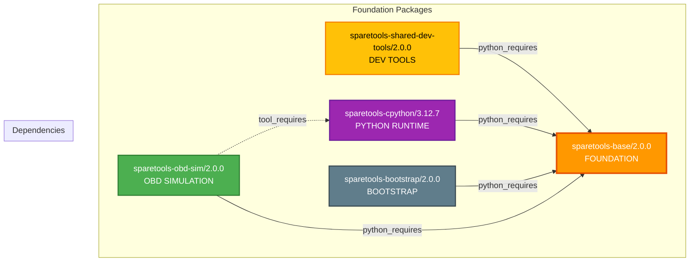
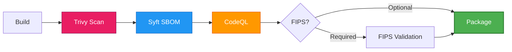
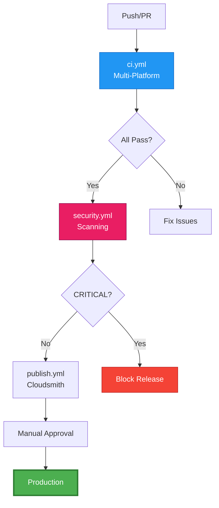

# SpareTools Conan Package Ecosystem

[](https://github.com/sparesparrow/sparetools/actions)
[](https://github.com/sparesparrow/sparetools/actions)
[](LICENSE)
[](https://conan.io)
[](https://www.python.org)

Modern Conan 2.x ecosystem for package development with integrated security scanning, zero-copy deployment patterns, and cross-platform tooling.

---

## 🚀 Quick Start (5 minutes)

### Install from Cloudsmith

```bash
# Add remote (one-time)
conan remote add sparesparrow-conan \
  https://dl.cloudsmith.io/public/sparesparrow-conan/sparetools/

# Install Python runtime
conan install --tool-requires=sparetools-cpython/3.12.7 --build=missing

# Install OBD simulation tools
conan install --requires=sparetools-obd-sim/2.0.0 --build=missing
```

### Build from Source

```bash
# Build Python runtime
conan create packages/sparetools-cpython --version=3.12.7 --build=missing

# Build OBD simulation tools
conan create packages/sparetools-obd-sim --version=2.0.0 --build=missing

# Build shared development tools
conan create packages/sparetools-shared-dev-tools --version=2.0.0 --build=missing
```

---

## 📋 Repository Separation Notice

**December 2025**: OpenSSL packages have been separated into a dedicated repository for better focus and maintainability.

### OpenSSL Packages Moved
- `sparetools-openssl` → [sparesparrow/openssl-conan](https://github.com/sparesparrow/openssl-conan)
- `sparetools-openssl-tools` → Moved to OpenSSL repository

### Migration Guide
For existing users of OpenSSL packages:
```bash
# Add new OpenSSL remote
conan remote add sparesparrow-openssl \
  https://dl.cloudsmith.io/public/sparesparrow-conan/openssl-conan/

# Update package references
# sparetools-openssl/3.3.2 -> from sparesparrow-openssl remote
```

---

## 📊 Architecture at a Glance

### Package Ecosystem



### Package Types

**Foundation Layer:**
- `sparetools-base`: Core utilities, security gates, zero-copy patterns
- `sparetools-cpython`: Prebuilt Python 3.12.7 runtime environment

**Tooling Layer:**
- `sparetools-shared-dev-tools`: Development and build automation tools
- `sparetools-bootstrap`: Package bootstrap and initialization utilities

**Application Layer:**
- `sparetools-obd-sim`: OBD-II simulation tools for automotive development

---

## ✨ Key Features

### Zero-Copy Deployment
```
~/.conan2/p/openssl/   → 500 MB (single copy)
_Build/packages/       → 50 KB (symlinks)
workspace/lib/         → 50 KB (symlinks)
────────────────────────────────────────────
Traditional copies:    1.5 GB
With symlinks:         500 MB
Savings:              ✅ 66% (1 GB saved)
```

### Multi-Platform Support
| Platform | Compiler | Status |
|----------|----------|--------|
| Linux | GCC 11+ | ✅ Stable |
| Linux | Clang 14+ | ✅ Stable |
| macOS | Apple Clang | ✅ Stable |
| Windows | MSVC 2022 | ⚠️ Experimental |

### Security Integration


---

## 📦 Package Overview

| Package | Version | Type | Purpose |
|---------|---------|------|---------|
| **sparetools-openssl** | 3.3.2 | library | OpenSSL with 4 build methods |
| **sparetools-openssl-tools** | 2.0.0 | python-require | Build profiles, FIPS validator |
| **sparetools-base** | 2.0.0 | python-require | Foundation utilities, security gates |
| **sparetools-cpython** | 3.12.7 | application | Prebuilt Python 3.12.7 runtime |
| **sparetools-shared-dev-tools** | 2.0.0 | python-require | Dev utilities, helpers |
| **sparetools-bootstrap** | 2.0.0 | python-require | 3-agent orchestration system |
| **sparetools-mcp-orchestrator** | 2.0.0 | python-require | MCP/AI integration |

→ **Full details:** [docs/PACKAGES.md](docs/PACKAGES.md)

---

## 🎯 Common Tasks

### Building

```bash
# Quick build (Perl Configure)
conan create packages/sparetools-openssl --version=3.3.2

# With specific profile
conan create packages/sparetools-openssl --version=3.3.2 \
  -pr:b packages/sparetools-openssl-tools/profiles/base/linux-gcc11

# With features
conan create packages/sparetools-openssl --version=3.3.2 \
  -pr:b packages/sparetools-openssl-tools/profiles/features/fips-enabled \
  -pr:b packages/sparetools-openssl-tools/profiles/features/performance
```

### Testing

```bash
# Run integration test
conan test packages/sparetools-openssl/test_package \
  sparetools-openssl/3.3.2

# Run unit tests
pytest test/unit/ -v

# With coverage
pytest test/unit/ --cov=packages/sparetools-base --cov-report=html
```

### Security Scanning

```bash
# Trivy vulnerability scan
trivy fs --security-checks vuln .

# Generate SBOM
syft packages . -o cyclonedx-json > sbom.json

# FIPS validation (if module present)
python3 -c "from bootstrap.openssl.fips_validator import FIPSValidator; \
  FIPSValidator().validate_module('/path/to/fips/module')"
```

### Publishing

```bash
# Build all packages in order
conan create packages/sparetools-base --version=2.0.0
conan create packages/sparetools-cpython --version=3.12.7
conan create packages/sparetools-openssl-tools --version=2.0.0
conan create packages/sparetools-openssl --version=3.3.2

# Upload to Cloudsmith (requires CLOUDSMITH_API_KEY)
conan upload "sparetools-*/*" -r sparesparrow-conan --confirm
```

→ **More examples:** [docs/QUICK-REFERENCE.md](docs/QUICK-REFERENCE.md)

---

## 📚 Documentation

### Getting Started
- **[Quick Reference](docs/QUICK-REFERENCE.md)** - Commands and options cheat sheet (5 min)
- **[Architecture](ARCHITECTURE.md)** - Visual system design with mermaid diagrams (15 min)
- **[Testing Guide](docs/TESTING-GUIDE.md)** - Comprehensive testing procedures

### Operations
- **[CI/CD Guide](docs/CI-CD-GUIDE.md)** - GitHub Actions workflows and operations
- **[CI/CD Troubleshooting](docs/CI-CD-TROUBLESHOOTING.md)** - Common workflow issues
- **[GitHub Secrets Setup](docs/GITHUB-SECRETS-SETUP.md)** - Configure CI/CD secrets

### Reference
- **[Package Reference](docs/PACKAGES.md)** - Complete package documentation
- **[Migration Guide](docs/MIGRATION-GUIDE.md)** - Upgrade from v1.x to v2.0.0
- **[OpenSSL 3.6.0 Analysis](docs/OPENSSL-360-BUILD-ANALYSIS.md)** - Deep dive on 3.6.0 builds
- **[Assembly Optimizations](docs/ASSEMBLY-OPTIMIZATIONS.md)** - Performance tuning
- **[Workspace Guide](docs/WORKSPACE-GUIDE.md)** - VS Code setup

### Changelog
- **[CHANGELOG.md](CHANGELOG.md)** - Version history and breaking changes
- **[CONTRIBUTING.md](CONTRIBUTING.md)** - How to contribute

---

## 🏗️ CI/CD Pipeline



**Active Workflows:**
- `ci.yml` - Multi-platform builds (Linux, macOS, Windows)
- `security.yml` - Trivy, Syft, CodeQL, FIPS validation
- `publish.yml` - Cloudsmith + GitHub Packages publishing
- `nightly.yml` - Daily comprehensive regression testing
- `release.yml` - Version management and releases

→ **Details:** [docs/CI-CD-GUIDE.md](docs/CI-CD-GUIDE.md)

---

## 🤝 Support

- **Issues:** [GitHub Issues](https://github.com/sparesparrow/sparetools/issues)
- **Discussions:** [GitHub Discussions](https://github.com/sparesparrow/sparetools/discussions)
- **Packages:** [Cloudsmith Repository](https://cloudsmith.io/~sparesparrow-conan/repos/openssl-conan/)
- **CI/CD:** [GitHub Actions](https://github.com/sparesparrow/sparetools/actions)

---

## 📄 License

Apache License 2.0 - see [LICENSE](LICENSE) for details.

---

## 🎉 Quick Links

| Resource | Description |
|----------|-------------|
| [Packages](docs/PACKAGES.md) | Complete package reference |
| [Architecture](ARCHITECTURE.md) | System design diagrams |
| [Quick Reference](docs/QUICK-REFERENCE.md) | Command cheat sheet |
| [CI/CD Guide](docs/CI-CD-GUIDE.md) | Workflow operations |
| [Testing Guide](docs/TESTING-GUIDE.md) | Test procedures |
| [Cloudsmith](https://cloudsmith.io/~sparesparrow-conan/repos/openssl-conan/) | Package registry |

**Repository:** https://github.com/sparesparrow/sparetools
**v2.0.0** | **Conan 2.21.0+** | **Python 3.12+** | **OpenSSL 3.3.2**
