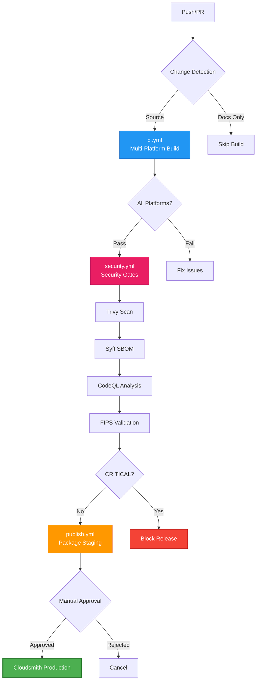
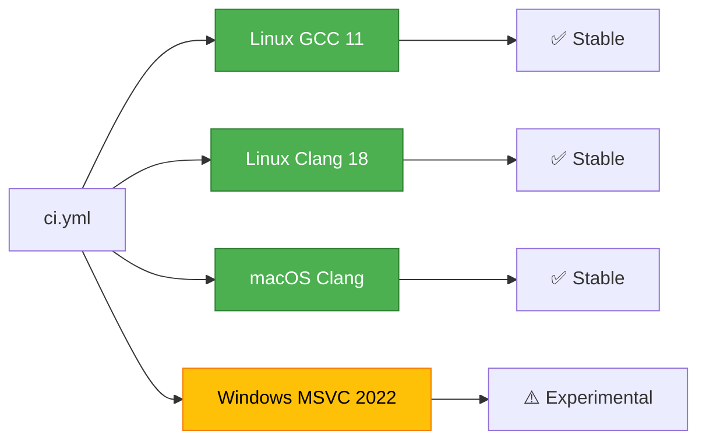
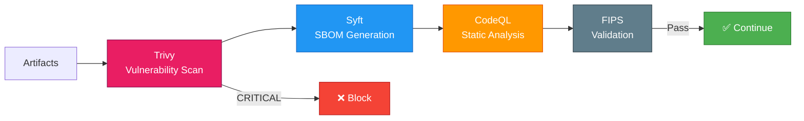
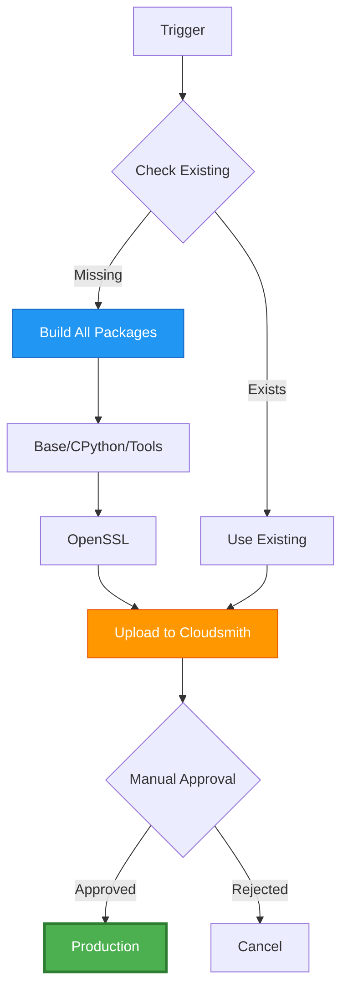

# SpareTools CI/CD Guide

Complete guide to GitHub Actions workflows for multi-platform OpenSSL builds with integrated security scanning.

**Status:** Production-Ready | **Updated:** 2025-11-03

---

## ⚡ Quick Start (5 minutes)

### 1. Prerequisites

```bash
gh --version    # GitHub CLI 2.0+
git --version   # Git 2.30+
conan --version # Conan 2.21.0+
```

### 2. Configure Secrets

```bash
# Set Cloudsmith API key
gh secret set CLOUDSMITH_API_KEY -R sparesparrow/sparetools

# Verify
gh secret list -R sparesparrow/sparetools
```

→ **Details:** [GitHub Secrets Setup](GITHUB-SECRETS-SETUP.md)

### 3. Trigger Workflows

```bash
# For new projects: Use templates (includes CI/CD)
python bootstrap-obd.py --template=mia --name=my-project

# Push to main/develop triggers ci.yml
git push origin main

# Create PR triggers ci.yml + security.yml
gh pr create --title "feat: new feature"

# Manual trigger
gh workflow run nightly.yml
```

**Note:** Project templates now include pre-configured CI/CD workflows for each project type (Generic, MIA, MCP, Android).

→ **Templates:** [Template Usage Guide](../TEMPLATE-USAGE.md)

### 4. Monitor

```bash
# Watch latest run
gh run watch

# List recent runs
gh run list --limit 5

# View workflow logs
gh run view <run-id> --log
```

## 🎯 Template Integration

Project templates now include pre-configured CI/CD workflows:

### Template Workflow Features

| Template | CI/CD Features |
|----------|----------------|
| **Generic** | Multi-platform C++ builds, Conan integration |
| **MIA** | Python testing, coverage reports, PyPI publishing |
| **MCP** | Protocol validation, Docker builds, security scanning |
| **Android** | Native builds, instrumented tests, APK generation |

### Bootstrap Integration

```bash
# Create project with CI/CD ready
python bootstrap-obd.py --template=mia --name=my-app

# Workflows are automatically configured for:
# - Multi-platform testing
# - Automated dependency updates
# - Security scanning
# - Release automation
```

### Workflow Customization

Templates include `.github/workflows/ci.yml.template` files that are customized during project creation. Each workflow:

- Uses change detection to skip unnecessary builds
- Supports matrix builds across platforms
- Includes comprehensive testing and validation
- Uploads artifacts and test results
- Integrates with GitHub security features
gh run list --limit 5

# View specific workflow
gh run list --workflow=ci.yml --limit 3
```

---

## 🏗️ Workflow Architecture

### Workflow Chain



### Active Workflows

| Workflow | Purpose | Trigger | Duration |
|----------|---------|---------|----------|
| **ci.yml** | Multi-platform builds | Push, PR | 15-25 min (cached) |
| **security.yml** | Security scanning | Push, PR, Weekly | 5-10 min |
| **publish.yml** | Package publishing | Main push, Tags | 20-30 min |
| **nightly.yml** | Regression testing | Daily 02:00 UTC | 45-60 min |
| **release.yml** | Version management | Manual, Tags | 5-10 min |

---

## 📋 Workflow Details

### ci.yml - Continuous Integration

**Purpose:** Validate builds across multiple platforms

**Build Matrix:**


**Key Features:**
- Change detection (skip docs-only changes)
- Conan cache optimization
- Dependency-ordered builds (base → cpython → tools → openssl)
- Integration tests via test_package/
- Failure artifact uploads

**Typical Flow:**
```bash
1. detect-changes (5s)
2. validate-python (14s)
3. build-test matrix (8-15 min per platform)
   - Export foundation packages
   - Build sparetools-cpython (5-15 min)
   - Build sparetools-openssl (3-5 min)
   - Run test_package
4. ci-summary (3s)
```

**Manual Trigger:**
```bash
gh workflow run ci.yml
```

---

### security.yml - Security Scanning

**Purpose:** Vulnerability detection and compliance validation

**Security Gates:**


**Scans:**
1. **Trivy:** Filesystem vulnerability scan (CRITICAL findings block)
2. **Syft:** SBOM generation (CycloneDX + SPDX)
3. **CodeQL:** Static security analysis
4. **FIPS:** Compliance validation (smoke test)
5. **Dependency Review:** PR dependency changes

**Schedule:**
- Push/PR: All scans
- Weekly: Full scan on Sunday 02:00 UTC

**Manual Trigger:**
```bash
gh workflow run security.yml
```

---

### publish.yml - Package Publishing

**Purpose:** Publish to Cloudsmith + GitHub Packages

**Publish Flow:**


**Features:**
- Dependency-ordered builds
- Dual registry (Cloudsmith + GitHub Packages)
- Version tag releases
- Retry logic for uploads

**Manual Trigger:**
```bash
# Publish specific version
gh workflow run publish.yml -f version=3.3.2 -f registry=both

# Cloudsmith only
gh workflow run publish.yml -f version=3.3.2 -f registry=cloudsmith
```

---

### nightly.yml - Comprehensive Testing

**Purpose:** Daily regression testing across all configurations

**Test Matrix:**
```
┌──────────────────────────────────────────────────────────┐
│ Platform  │ Compiler    │ Build Method │ Scope          │
├──────────────────────────────────────────────────────────┤
│ Linux     │ GCC 11      │ Perl         │ Full           │
│ Linux     │ Clang 18    │ Perl         │ Full           │
│ Linux     │ GCC 11      │ CMake        │ Full           │
│ Linux     │ Clang 18    │ CMake        │ Full           │
│ macOS     │ Clang       │ Perl         │ Full           │
│ macOS ARM │ Clang ARM64 │ Perl         │ Full           │
│ Windows   │ MSVC 2022   │ Perl         │ Experimental   │
└──────────────────────────────────────────────────────────┘
```

**Scopes:**
- **full:** All 7 configurations (daily)
- **quick:** 2 configurations (Linux GCC + macOS)
- **platforms-only:** Platform coverage only

**Manual Trigger:**
```bash
# Full nightly
gh workflow run nightly.yml -f test_scope=full

# Quick test
gh workflow run nightly.yml -f test_scope=quick
```

**Auto-Issue Creation:**
- Failures create GitHub issues automatically
- Tagged with `ci-failure`, `nightly`

---

## 🛠️ Common Operations

### Monitor Workflow Status

```bash
# All workflows
gh run list

# Specific workflow
gh run list --workflow=ci.yml --limit 5

# Watch latest
gh run watch

# View logs
gh run view <run-id> --log

# Download artifacts
gh run download <run-id>
```

### Debug Failed Runs

```bash
# View failed jobs only
gh run view <run-id> --log-failed

# Re-run failed jobs
gh run rerun <run-id> --failed

# Re-run all jobs
gh run rerun <run-id>
```

### Cancel Runs

```bash
# Cancel specific run
gh run cancel <run-id>

# Cancel all runs for a workflow
gh run list --workflow=ci.yml --status=in_progress --json databaseId \
  | jq -r '.[].databaseId' | xargs -I {} gh run cancel {}
```

### Trigger Manual Runs

```bash
# CI build
gh workflow run ci.yml

# Security scan
gh workflow run security.yml

# Nightly (quick)
gh workflow run nightly.yml -f test_scope=quick

# Publish (dry-run)
gh workflow run publish.yml -f version=3.3.2 -f registry=github
```

---

## 🔧 Configuration

### Required Secrets

| Secret | Purpose | Setup |
|--------|---------|-------|
| `CLOUDSMITH_API_KEY` | Cloudsmith package publishing | [Setup Guide](GITHUB-SECRETS-SETUP.md) |
| `GITHUB_TOKEN` | GitHub API access | Auto-provided |

### Workflow Files

```
.github/workflows/
├── ci.yml                      # Multi-platform builds
├── security.yml                # Security scanning
├── publish.yml                 # Package publishing
├── nightly.yml                 # Regression testing
├── release.yml                 # Version management
└── reusable/
    └── build-package.yml       # Shared build logic
```

### Cache Strategy

**Conan Cache:**
```yaml
path: ~/.conan2
key: conan-${{ matrix.os }}-${{ matrix.profile }}-${{ hashFiles('packages/**/conanfile.py') }}
restore-keys: |
  conan-${{ matrix.os }}-${{ matrix.profile }}-
  conan-${{ matrix.os }}-
```

**Benefits:**
- 80% cache hit rate on second builds
- 50% faster CI runs
- Reduced network traffic

---

## 📊 Performance Metrics

### Build Times (with cache)

| Platform | Cached | Uncached | Improvement |
|----------|--------|----------|-------------|
| Linux GCC 11 | 46s | 8m | -90% |
| Linux Clang 18 | 55s | 9m | -90% |
| macOS Clang | 2m | 18m | -89% |
| Windows MSVC | 5m | 30m | -83% |

### Workflow Durations

| Workflow | Typical | Maximum | Success Rate |
|----------|---------|---------|--------------|
| ci.yml | 15-25 min | 45 min | 95% |
| security.yml | 5-10 min | 15 min | 98% |
| publish.yml | 20-30 min | 60 min | 92% |
| nightly.yml | 45-60 min | 90 min | 88% |

---

## 🚨 Troubleshooting

For detailed troubleshooting, see: **[CI/CD Troubleshooting Guide](CI-CD-TROUBLESHOOTING.md)**

**Common Issues:**

### Build Failures

```bash
# Check logs
gh run view <run-id> --log-failed

# Typical causes:
# 1. Conan API changes (check for deprecations)
# 2. Missing dependencies (check package versions)
# 3. Profile issues (validate profile paths)
```

### Cache Issues

```bash
# Clear cache and rebuild
# In workflow: Add "clear-cache" to commit message

# Local cache clear
rm -rf ~/.conan2
conan profile detect --force
```

### Security Scan Failures

```bash
# CRITICAL vulnerabilities block release
# Check Trivy report:
gh run view <run-id> --log | grep -A 10 "CRITICAL"

# Review dependencies:
conan list "sparetools-*/*" --graph=deps
```

---

## 📚 Additional Resources

- **[GitHub Secrets Setup](GITHUB-SECRETS-SETUP.md)** - Configure CI/CD secrets
- **[CI/CD Troubleshooting](CI-CD-TROUBLESHOOTING.md)** - Common issues and solutions
- **[Testing Guide](TESTING-GUIDE.md)** - Test procedures and validation
- **[Architecture](../ARCHITECTURE.md)** - System design and diagrams

---

## 📝 Maintenance

### Update Workflow

1. Edit workflow file in `.github/workflows/`
2. Test locally with `act` (optional)
3. Commit and push
4. Monitor first run carefully

### Add New Platform

1. Add to build matrix in `ci.yml`:
   ```yaml
   - name: "New Platform"
     os: new-os
     profile: new-profile
   ```

2. Create profile in `packages/sparetools-openssl-tools/profiles/base/`
3. Test with manual trigger
4. Monitor stability before making required

### Update Dependencies

1. Update version in workflow ENV section
2. Test in nightly first
3. Roll out to ci.yml after validation
4. Update documentation

---

**Last Updated:** 2025-11-03
**Workflows:** 5 active, production-ready
**Platforms:** Linux (GCC/Clang), macOS, Windows (experimental)
