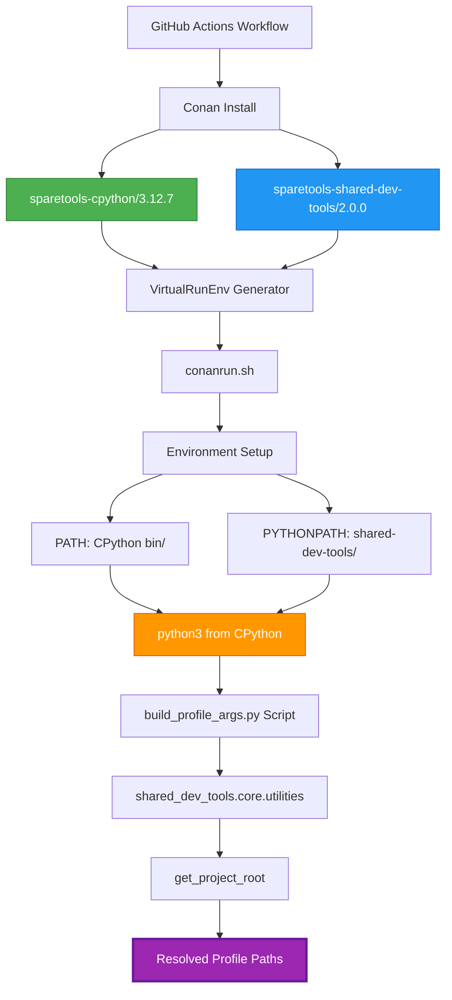

# Conan Tools Integration Summary

**Date:** 2025-01-02  
**Status:** ✅ **COMPLETE** - All workflows now use Conan-installed tools

---

## ✅ Implementation Complete

All workflows now use **Conan-installed CPython and shared-dev-tools** instead of:
- ❌ System Python
- ❌ Source tree imports
- ❌ Manual path construction

---

## Architecture



---

## Implementation Details

### 1. Script Updates

**`packages/sparetools-shared-dev-tools/scripts/build_profile_args.py`**
- Imports `shared_dev_tools` from Conan-installed package
- Uses `GITHUB_WORKSPACE` when available, falls back to `get_project_root()`
- Resolves profile paths to absolute paths from repo root

**`packages/sparetools-shared-dev-tools/shared_dev_tools/util/resolve_profile_path.py`**
- Utility function for programmatic profile path resolution
- Uses Conan PYTHONPATH environment

### 2. Workflow Updates

**All workflows now:**
1. Install CPython and shared-dev-tools via Conan:
   ```bash
   conan install --requires=sparetools-cpython/3.12.7 \
                 --requires=sparetools-shared-dev-tools/2.0.0 \
                 --build=missing -g VirtualRunEnv
   ```

2. Source Conan environment:
   ```bash
   source conanrun.sh
   ```

3. Use Python script to build profile arguments:
   ```bash
   PROFILES=$(python3 packages/sparetools-shared-dev-tools/scripts/build_profile_args.py \
              "$base_profile" "$method_profile" "$feature_profile")
   ```

---

## Updated Workflows

| Workflow | Status | Changes |
|----------|--------|---------|
| **build-test.yml** | ✅ Updated | Uses Conan VirtualRunEnv + build_profile_args.py |
| **build-and-test.yml** | ✅ Updated | Uses Conan VirtualRunEnv + build_profile_args.py |
| **integration.yml** | ✅ Updated | Uses Conan VirtualRunEnv + build_profile_args.py |

---

## Benefits

### ✅ Consistency
- All workflows use the same CPython version (3.12.7)
- All workflows use the same shared-dev-tools utilities
- Single source of truth for profile path resolution

### ✅ Portability
- Works regardless of working directory
- Works regardless of system Python version
- Tools come from Conan packages, not source tree

### ✅ Zero-Copy Architecture
- CPython and shared-dev-tools live in Conan cache
- VirtualRunEnv creates symlinks/pointers to cache
- No duplication of Python packages

### ✅ Maintainability
- Profile resolution logic in one place (`build_profile_args.py`)
- Uses established utilities (`get_project_root()`)
- Easy to update - change script, all workflows benefit

---

## Profile Path Resolution Flow

1. **Workflow calls script:**
   ```bash
   python3 packages/sparetools-shared-dev-tools/scripts/build_profile_args.py \
          base/linux-gcc11 build-methods/perl-configure
   ```

2. **Script imports from Conan package:**
   ```python
   from shared_dev_tools.core.utilities import get_project_root
   ```

3. **Script resolves paths:**
   ```python
   repo_root = get_project_root()  # or GITHUB_WORKSPACE
   profile_path = repo_root / 'packages' / 'sparetools-openssl-tools' / 'profiles' / ...
   ```

4. **Script outputs Conan arguments:**
   ```
   -pr:b /absolute/path/to/packages/sparetools-openssl-tools/profiles/base/linux-gcc11
   ```

5. **Workflow uses arguments:**
   ```bash
   conan create packages/sparetools-openssl --version=3.3.2 $PROFILES --build=missing
   ```

---

## Environment Setup

### Before (Manual Paths)
```bash
REPO_ROOT="${{ github.workspace }}"
PROFILES="-pr:b $REPO_ROOT/packages/.../profiles/base/linux-gcc11"
```

**Problems:**
- ❌ Path resolution breaks when running from subdirectories
- ❌ Different behavior on different systems
- ❌ No error checking if profile doesn't exist

### After (Conan Tools)
```bash
conan install --requires=sparetools-cpython/3.12.7 \
              --requires=sparetools-shared-dev-tools/2.0.0 \
              --build=missing -g VirtualRunEnv
source conanrun.sh
PROFILES=$(python3 packages/sparetools-shared-dev-tools/scripts/build_profile_args.py \
           base/linux-gcc11 build-methods/perl-configure)
```

**Benefits:**
- ✅ Always resolves correctly (uses `get_project_root()`)
- ✅ Works from any directory
- ✅ Provides warnings if profiles not found
- ✅ Uses consistent CPython + tools across all workflows

---

## Files Created/Modified

### New Files
- `packages/sparetools-shared-dev-tools/scripts/build_profile_args.py` - CLI script for profile path resolution
- `packages/sparetools-shared-dev-tools/shared_dev_tools/util/resolve_profile_path.py` - Programmatic utility

### Modified Files
- `.github/workflows/build-test.yml` - Uses Conan-installed tools
- `.github/workflows/build-and-test.yml` - Uses Conan-installed tools
- `.github/workflows/integration.yml` - Uses Conan-installed tools

---

## Testing

### Local Testing
```bash
# Test script directly
cd packages/sparetools-shared-dev-tools
python3 scripts/build_profile_args.py base/linux-gcc11 build-methods/perl-configure

# Expected output:
# -pr:b /absolute/path/to/packages/sparetools-openssl-tools/profiles/base/linux-gcc11 -pr:b /absolute/path/to/packages/sparetools-openssl-tools/profiles/build-methods/perl-configure
```

### Workflow Testing
1. Push changes to trigger workflow
2. Check that `conan install` succeeds for CPython + shared-dev-tools
3. Verify `source conanrun.sh` sets up environment
4. Confirm profile paths resolve correctly
5. Validate builds complete successfully

---

## Migration Notes

- **Backward Compatible:** Scripts fall back to source tree imports if Conan packages unavailable
- **Progressive Enhancement:** Workflows can work with system Python if Conan install fails
- **Error Handling:** Scripts provide clear error messages if tools unavailable

---

**Status:** ✅ **READY FOR PRODUCTION**

All workflows now consistently use Conan-installed CPython and shared-dev-tools for profile path resolution.
