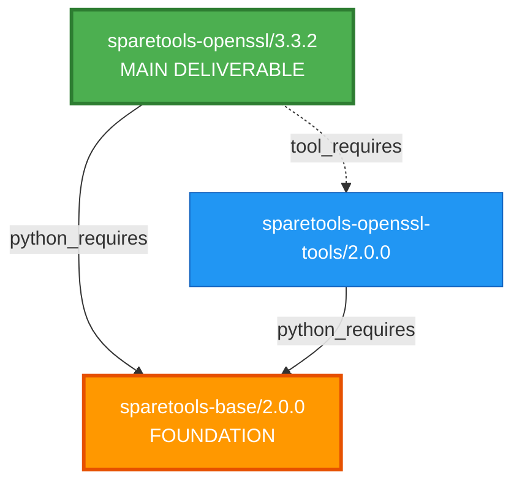
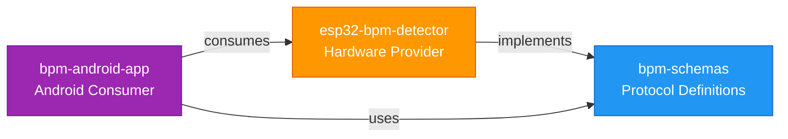

# SpareTools Documentation Templates

This directory contains templates, tools, and utilities for generating consistent documentation with Mermaid diagrams using the SpareTools color scheme.

## Directory Structure

```
templates/docs/
├── README.md                          # This file
├── colors/
│   └── sparetools-colors.md          # Color scheme reference
├── generators/
│   ├── __init__.py
│   ├── mermaid_generator.py          # Mermaid diagram generator
│   ├── diagram_types.py              # Diagram type definitions
│   └── renderer.py                   # Diagram renderer (optional)
├── prompts/
│   ├── generate_diagram.json         # Prompt template for diagram generation
│   ├── analyze_diagram.json         # Prompt template for diagram analysis
│   └── modify_diagram.json           # Prompt template for diagram modification
├── mcp_tools/
│   ├── __init__.py
│   ├── diagram_tools.py              # MCP tools for diagram generation
│   └── server_integration.py        # Integration examples
└── templates/
    ├── ARCHITECTURE.md.template      # Architecture documentation template
    ├── README.md.template            # README with mermaid examples
    └── PACKAGE-README.md.template    # Package-specific README template
```

## Quick Start

### Using the Color Scheme

Reference the SpareTools color scheme in your Mermaid diagrams:


See [colors/sparetools-colors.md](colors/sparetools-colors.md) for the complete color palette.

### Using the Mermaid Generator

```python
from pathlib import Path
from templates.docs.generators import MermaidGenerator, DiagramType, DiagramConfig

# Initialize generator
generator = MermaidGenerator()
generator.initialize()

# Generate a flowchart
nodes = [
    {"id": "A", "label": "Schema Package", "layer_type": "schema"},
    {"id": "B", "label": "Provider Package", "layer_type": "provider"},
    {"id": "C", "label": "Consumer Package", "layer_type": "consumer"},
]

edges = [
    {"from": "A", "to": "B", "label": "defines"},
    {"from": "B", "to": "C", "label": "implements"},
]

config = DiagramConfig(type=DiagramType.FLOWCHART)
diagram = generator.generate_flowchart(nodes, edges, "TD", config)

# Apply SpareTools colors
node_mapping = {node["id"]: node["layer_type"] for node in nodes}
diagram = generator.apply_sparetools_colors(diagram, node_mapping)

print(diagram)
```

### Using Documentation Templates

The templates use Jinja2-style variables. Example:

```markdown
# {{project_name}} Architecture

## Overview

{{project_description}}
```

To use a template:

1. Copy the template file to your project
2. Replace variables with actual values
3. Customize as needed

Example templates:
- `templates/ARCHITECTURE.md.template` - Full architecture documentation
- `templates/README.md.template` - Project README with diagrams
- `templates/PACKAGE-README.md.template` - Package-specific README

### Integrating MCP Tools

To add diagram generation tools to your MCP server:

```python
from fastmcp import FastMCP
from pathlib import Path
from templates.docs.mcp_tools import register_diagram_tools

# Create MCP server
mcp = FastMCP("My Documentation Server")

# Register diagram tools
templates_dir = Path(__file__).parent / "templates" / "docs" / "prompts"
register_diagram_tools(mcp, templates_dir)
```

See [mcp_tools/server_integration.py](mcp_tools/server_integration.py) for more examples.

## Color Scheme Reference

| Component Type | Fill Color | Stroke Color | Text Color | Usage |
|---------------|------------|--------------|------------|-------|
| Schema Layer | #2196F3 | #1565C0 | #fff | BPM schemas, protocol definitions |
| Provider Layer | #FF9800 | #E65100 | #fff | ESP32 firmware, hardware providers |
| Consumer Layer | #9C27B0 | #6A1B9A | #fff | Android apps, consumers |
| Tooling Layer | #FFC107 | #F57C00 | #000 | sparetools, shared utilities |
| Success/Production | #4CAF50 | #2E7D32 | #fff | Final states, production deployments |
| Utilities/Bootstrap | #607D8B | #37474F | #fff | Bootstrap, utilities |
| Security/Errors | #E91E63 / #F44336 | #880E4F / #B71C1C | #fff | Security scanning, blocking states |

## Prompt Templates

The prompt templates in `prompts/` can be used with AI assistants to generate diagrams:

- **generate_diagram.json**: Generate new diagrams from descriptions
- **analyze_diagram.json**: Analyze existing diagrams for improvements
- **modify_diagram.json**: Modify existing diagrams

These prompts include SpareTools color scheme guidance.

## Examples

### Conan Package Example



### Python Package Example



## Integration Points

- **Conan Projects**: Use templates for package documentation
- **Python Projects**: Use generators for API documentation
- **MCP Servers**: Integrate tools for AI-assisted diagram generation
- **CI/CD**: Include diagram validation in documentation workflows

## Dependencies

- Python 3.12+ (for type hints and dataclasses)
- pathlib (standard library)
- json (standard library)
- Optional: mermaid CLI for rendering (documented but not required)

## Testing

To verify diagrams render correctly:

1. Generate a diagram using the generator
2. Copy the Mermaid code
3. Paste into [Mermaid Live Editor](https://mermaid.live/) or your documentation renderer
4. Verify colors and structure match SpareTools standards

## Contributing

When adding new templates or generators:

1. Follow the SpareTools color scheme
2. Include examples in documentation
3. Update this README with new features
4. Ensure templates are compatible with Jinja2-style variable substitution

## Related Documentation

- [SpareTools Architecture](../../ARCHITECTURE.md)
- [Package README Template](../../docs/PACKAGE-README-TEMPLATE.md)
- [MCP Project Orchestrator](../../../../ai-mcp-monorepo/packages/mcp-project-orchestrator/) (source of adapted code)

---

*Last Updated: 2025-01-XX*
